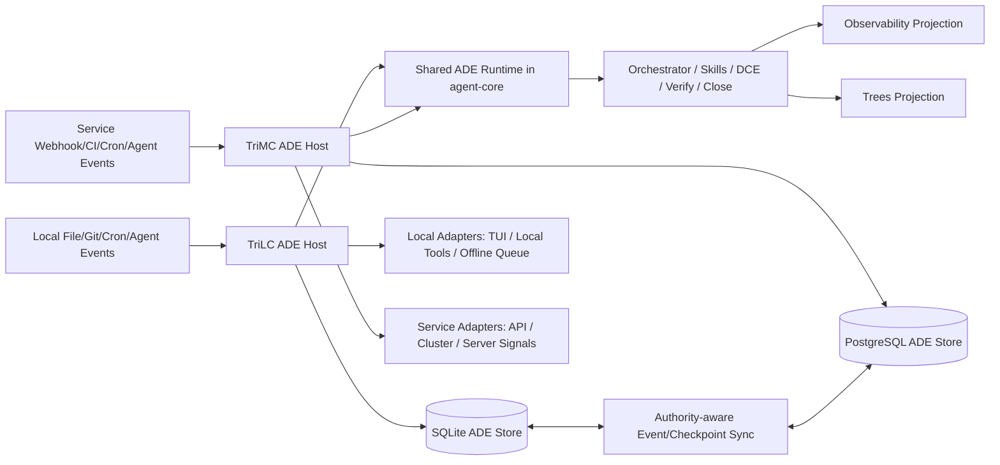

# ADE 全生命周期实现蓝图

版本：V1.0
日期：2026-08-07
状态：CPO / CTO 岗位实例审计完成；完整方案 FREEZE，Phase -1 与裁剪版 local-first MVP 待 CEO 确认

## 文档同步元信息

- sourceOfTruth: TriCompany/docs/engineering/ade-full-lifecycle-implementation-plan.md
- syncMode: source-only
- lastSyncedAt: 2026-08-07

## 1. 目标与边界

目标是在不复制现有 Agent loop、Skill、调度、事件队列和 Trees 协议的前提下，补齐 ADE 的完整生命周期：

```text
Event / Agent detection
-> durable run registration
-> Qualify Agent
-> Plan Skill
-> DCE
-> Verify CLI（可选）
-> Close Skill
-> Close CLI
-> terminal state
```

支持两个 profile：

- `runtime-owned-durable`
- `agent-owned-interactive`

本规划不把以下现有对象直接改名为 ADE run：

- TriLC conversation session
- TriLC offline event
- TriMC TaskController task
- Trees `task_trees` / `tree_nodes`
- TriMC observability trace / replay

它们分别是会话、传输、粗粒度任务、组织编排和审计投影，不具备完整 ADE run 语义。

### 1.1 当前阶段审计结论

2026-08-07 CPO / CTO 岗位实例完成 TriLC 代码与测试审计。结论：完整 ADE 开工 `FREEZE`，裁剪版 local-first MVP `APPROVE`。

当前 TriLC 已具备共享 Agent loop、工具、SkillTool、permissions、session、cron、heartbeat、daemon 等基础组件，但尚未具备 durable run/checkpoint、持久 Signal、DCE registry/probe、Close CLI、authority 或 Trees projector。

详细差距和 P0 门禁见 [ADE 与 TriLC 当前实现差距评估](ade-trilc-current-gap-assessment.md)。未完成 P0 前，本蓝图只作为目标设计，不表示当前运行能力。

## 2. 总体架构



## 3. 模块 Ownership

双域共享边界、local-first / service-first 同步节律与 parity gate 以 [TriLC / TriMC 共享 Runtime Parity 决策](trilc-trimc-runtime-parity.md) 为准。

### 3.1 `@trimetaverse/agent-core`：共享 ADE Runtime

新增目录建议：

```text
TriMC/packages/agent-core/src/ade/
  types.ts
  state-machine.ts
  contracts.ts
  orchestrator.ts
  phase-runner.ts
  dce-registry.ts
  close-finalizer.ts
  recovery-policy.ts
  store-interfaces.ts
  sync-contract.ts
  idempotency.ts
  errors.ts
```

共享实现：

- ADE 状态枚举和合法转换。
- Event / Plan / DCE / Verify / Close decision schema。
- Profile、retry policy、checkpoint metadata 类型。
- 可注入的完整 orchestrator、Plan / Close phase runner、DCE registry 和 Close finalizer。
- checkpoint / recovery policy、幂等键和 authority sync 合同。
- storage、Skill resolver、DCE executor、Signal 和 projector 的 adapter 接口。
- 共享测试向量。

禁止承载：具体 SQLite / PostgreSQL、HTTP、文件 watcher、具体 Skill 内容、shell 子进程、TUI 和 Trees 文件写入。这些由 TriLC / TriMC 注入 adapter。

共享包的物理位置继续沿用已批准的 `TriMC/packages/agent-core/`，但物理代码 owner 不代表 TriMC 服务域永远持有每个 run 的写权威；TriLC 构建时将同一 runtime bundle 到本地，可独立运行。

### 3.2 TriMC：服务域 ADE Host

新增目录建议：

```text
TriMC/src/ade/
  postgres-store.ts
  service-skill-resolver.ts
  service-dce-executor.ts
  service-signal-adapter.ts
  service-trigger-adapter.ts
  recovery-worker.ts
  tree-projector.ts
  observability-projector.ts
  api.ts
```

TriMC 负责：

- 以 PostgreSQL 实现共享 ADE store 接口。
- webhook、CI、服务端 cron、API 等服务域 trigger adapter。
- 服务端 Skill / DCE / Signal adapter 和集群 worker lease。
- 服务域 run 的 authority、checkpoint、恢复和终态事务。
- 接收 TriLC 同步事件，并按 authority / version 校验投影或显式接管。
- observability 与 Trees 投影。

### 3.3 TriLC：本地域 ADE Host

新增目录建议：

```text
TriLC/src/ade/
  detectors/file-detector.ts
  detectors/git-detector.ts
  sqlite-store.ts
  event-outbox.ts
  local-skill-resolver.ts
  local-dce-executor.ts
  local-signal-adapter.ts
  recovery-worker.ts
  tree-projector.ts
  observability-projector.ts
  api.ts
  sync-adapter.ts
```

TriLC 负责：

- 文件、Git、cron、heartbeat 等本地事件检测。
- 以 SQLite 实现与 TriMC 等价的共享 ADE store 接口。
- 本地域 run 的完整 orchestrator、Plan / Close Skill、checkpoint、恢复和 Close finalizer。
- 本地幂等去重、event outbox 与跨进程恢复。
- 本地 DCE 子进程执行、超时、取消、stdout JSON 解析。
- TUI human-in-the-loop 与 signal 上送。
- Agent-owned profile 的 register / status / signal 工具。
- 与 TriMC 双向同步 run event / checkpoint / terminal projection。

TriLC 已具备类 Claude Code 的 Agent loop、SkillTool、permissions、session、cron 和本地工具等基础组件，但完整产品语义和 durable lifecycle 尚未成立。ADE 首个裁剪 profile 优先在 TriLC 集成；可复用部分抽入 `agent-core` 后，TriMC 直接消费同一实现，不复制 orchestration。

### 3.4 双域 Authority 与同步

每个 run 必须声明：

```json
{
  "homeDomain": "local|service",
  "writeAuthority": "trilc:<node-id>|trimc:<cluster-id>",
  "authorityEpoch": 1,
  "version": 12
}
```

规则：

- 同一时刻只有一个 `writeAuthority` 可以推进 run 状态。
- 非权威域只保存只读 replica、待确认 signal 或 DCE delegation result。
- `homeDomain=local` 的本地文件/Git任务可由 TriLC 长期持有写权；TriMC 保存服务域可见投影。
- `homeDomain=service` 的 CI、webhook、服务集群任务由 TriMC 持有写权；需要本地工具时委托 TriLC 执行 DCE，但 run 状态仍由 authority 推进。
- authority 转移必须显式增加 `authorityEpoch`，完成 lease 交接和 checkpoint 同步；禁止 last-write-wins 双活合并。
- TriLC 与 TriMC 共享同一 schema、状态机、Skill/DCE/Close 合同和 conformance suite。

### 3.5 Trees：组织编排投影

Trees 继续负责：

- 谁负责该工作。
- 节点交付、next agent、升级和组织依赖。
- CEO / 总助可读的经营与任务视图。

Trees 不负责：

- ADE 内部 `PLANNING / EXECUTING / VERIFYING / CLOSING` 状态。
- checkpoint、tool result、Skill prompt 或 DCE stdout。
- retry attempt 和 lease。

建议在 `tree_nodes` 增加可选投影字段：

```json
{
  "execution_protocol": "ade",
  "ade_run_id": "ade_...",
  "ade_profile": "runtime-owned-durable",
  "ade_terminal_status": null,
  "ade_evidence_ref": null
}
```

映射规则：

- ADE run 注册后：tree node 维持 `in_progress`，仅写 `ade_run_id`。
- ADE `APPROVED`：节点可转 `done`，`delivery` 引用 close report。
- ADE `FROZEN`：节点保持 `in_progress` 或由总助显式转 `escalated`。
- ADE `ESCALATED`：节点转 `escalated`，由总助扩展分支。
- ADE `RETRY`：Trees 状态不变，只更新 evidence ref。

## 4. 统一数据模型与逐 Run 权威

TriLC SQLite 与 TriMC PostgreSQL 使用同一逻辑 schema 和 conformance suite。`canonical` 不再等同于固定 TriMC；每个 run 的 canonical 状态由 `write_authority + authority_epoch + version` 决定。

### 4.1 `ade_runs`

| 字段 | 说明 |
| --- | --- |
| `run_id` | 全局主键，建议 UUIDv7 前缀 `ade_` |
| `protocol_version` | ADE 协议版本 |
| `definition_id` / `definition_version` | 使用的 ADE 定义 |
| `profile` | `runtime-owned-durable` / `agent-owned-interactive` |
| `status` | ADE 状态机状态 |
| `trigger_owner` | `runtime` / `agent` / `user` |
| `home_domain` | `local / service` |
| `write_authority` | `trilc:<node-id>` / `trimc:<cluster-id>` |
| `authority_epoch` | 每次显式 authority 转移递增 |
| `origin_node_id` | 首次创建 run 的节点或集群 |
| `source_revision` | 触发时事实版本 |
| `idempotency_key` | 事件去重和重复注册防护 |
| `tree_id` / `tree_node_id` | 可选组织投影引用 |
| `session_id` / `trace_id` | 可选 Agent 与观测引用 |
| `plan_skill_ref` / `close_skill_ref` | 固定版本 Skill 引用 |
| `dce_ref` / `verify_ref` / `close_cli_ref` | CLI 合同引用 |
| `retry_budget` / `attempt` | 重试上限与当前次数 |
| `lease_owner` / `lease_expires_at` | worker 防双跑 lease |
| `version` / `sync_version` | authority 乐观锁与跨域同步版本 |
| `created_at` / `updated_at` / `terminal_at` | 生命周期时间 |

### 4.2 `ade_events`

追加式 event log：

```text
run.detected
run.qualified
plan.requested
plan.completed
plan.rejected
dce.started
dce.completed
dce.failed
verify.completed
signal.requested
signal.received
close.requested
close.decided
close.committed
run.retry_scheduled
run.recovered
run.terminal
```

字段至少包含：`event_id`、`run_id`、`sequence_no`、`event_type`、`actor`、`payload_json`、`idempotency_key`、`created_at`。

唯一约束：`(run_id, sequence_no)`、`idempotency_key`。

### 4.3 `ade_checkpoints`

每个稳定边界保存：

- `run_id`
- `checkpoint_no`
- `status`
- `state_json`
- `last_event_sequence`
- `source_revision`
- `artifact_refs`
- `created_at`

必须 checkpoint 的边界：Plan 完成后、DCE 前、DCE 后、进入等待 signal 前、Close decision 后、Close CLI 提交前。

### 4.4 `ade_signals`

用于外部 request / response 和 HITL：

- `signal_id`
- `run_id`
- `kind`: `approval | input | cancellation | retry-authorization`
- `correlation_id`
- `status`: `pending | resolved | expired | cancelled`
- `request_json` / `response_json`
- `requested_by` / `resolved_by`
- `expires_at`

### 4.5 `ade_artifacts`

只存引用和摘要，不把大文件塞数据库：

- `artifact_id`
- `run_id`
- `phase`
- `kind`
- `uri`
- `sha256`
- `media_type`
- `created_at`

## 5. 统一状态机

```text
DETECTED
-> QUALIFYING
-> PLANNING
-> PLANNED
-> EXECUTING
-> VERIFYING
-> WAITING_SIGNAL（可从需要外部响应的任意阶段进入）
-> CLOSING
-> FINALIZING
-> APPROVED | FROZEN | ESCALATED
```

`RETRY` 不建议作为持久终态，而是裁决动作：

```text
Close decision = RETRY
-> Close CLI 校验 retry budget
-> attempt + 1
-> checkpoint
-> 回到 PLANNING / EXECUTING / VERIFYING 中指定阶段
```

异常状态：

- `CLOSE_REJECTED`：Close decision 不满足 schema、权限或证据要求。
- `RECOVERY_REQUIRED`：lease 过期且无法自动判定恢复点。
- `CANCELLED`：显式取消终态。

## 6. 两个 Profile 的实现

### 6.1 Runtime-owned durable

触发源：本地域的 file watcher、Git hook、cron、heartbeat，或服务域的 webhook、CI、cron、API event。

执行：

1. 触发所在域生成 `AdeTriggerEvent`。
2. 当前 host 以 idempotency key `eventType + source + sourceRevision + definitionId` 去重并创建 run。
3. run 根据任务数据和 DCE 所在位置确定 `homeDomain / writeAuthority`。
4. 同一共享 Orchestrator 持有 run 直到 Close CLI 终态提交。
5. Agent / 进程中断后，由 authority 所在域的 recovery worker 从 checkpoint 继续。
6. 非权威域通过 event/checkpoint sync 获得只读投影。

适合：项目真源自动同步、定时审计、部署、账务、合规、长流程。

### 6.2 Agent-owned interactive

触发源：Agent 在当前 loop 中检测到需要 ADE。

新增 Agent 工具建议：

- `ade_register`
- `ade_get_status`
- `ade_submit_signal`
- `ade_cancel`

执行：

1. Agent 调用 `ade_register`，当前 TriLC 或 TriMC host 创建 durable run。
2. 当前 session 可驱动 Plan / DCE / Close，但 runtime 仍 checkpoint。
3. 如果 session 中断，run 由当前 authority host 的 recovery worker 接手，不退回普通聊天状态。
4. Close CLI 提交终态后，Agent 输出最终用户说明。

适合：会话内真源漂移、临时测试、即时修复、上下文密集任务。

## 7. Plan / Close Skill Runner

### 7.1 Skill 合同扩展

现有 SkillSpec 只有通用 `executionSteps`，ADE 需要新增或另建 `AdeSkillBinding`：

```json
{
  "skillRef": "tri-project-source-plan@1.0.0",
  "phase": "plan",
  "outputSchema": "ade-plan.schema.json",
  "allowedTools": ["read_file", "search"],
  "maxTurns": 8
}
```

Close Skill：

```json
{
  "skillRef": "tri-project-source-close@1.0.0",
  "phase": "close",
  "outputSchema": "ade-close-decision.schema.json",
  "allowedTools": ["read_file", "ade_get_status"],
  "maxTurns": 6
}
```

### 7.2 Runner 行为

- Runtime 主动解析 Skill 版本，不依赖模型自行决定是否调用 SkillTool。
- Skill 内容作为该 phase 的上下文输入，不永久注入员工 system prompt。
- Agent 输出必须经过 JSON schema 校验。
- 失败可重试一次；仍失败则进入 `FROZEN` 建议或 `RECOVERY_REQUIRED`。
- 保存 Skill ref、prompt hash、model、token usage 和结构化输出引用。

### 7.3 TriLC / TriMC 复用

- 复用 TriLC `load-skills-dir.ts` 的 SKILL.md 解析思想。
- 将通用 Skill resolver 与 phase runner 接口抽取到 `agent-core`；具体技能目录和权限由 host adapter 注入。
- TriLC SkillTool 继续服务 Agent 自主调用；TriLC / TriMC 的 ADE phase runner 都使用 runtime 主动装载 API。
- 两域必须对相同 Skill ref、输入与模型配置通过共享 contract tests；域差异只允许体现在可用工具和部署环境。

## 8. DCE / Verify 执行合同

### 8.1 禁止自由 shell 字符串

DCE registry 使用 argv 数组和固定 cwd：

```json
{
  "id": "project-source-doc-sync",
  "command": "python",
  "argsTemplate": ["-m", "runtime.cognition.source_publish_check", "--project-docs"],
  "cwdPolicy": "TriCompany-root",
  "timeoutMs": 600000,
  "offlineAllowed": true,
  "reportSchema": "project-doc-sync-report.schema.json"
}
```

### 8.2 每个 DCE 必须提供

- `probe`：判断当前副作用是否已发生。
- `execute`：执行一次。
- `verify`：输出结构化证据。
- `cancel`：可选取消。
- `idempotencyKey`：副作用幂等。
- `resumePolicy`：崩溃后 `probe-then-resume | retry-safe | manual`。

### 8.3 effectively-once

不承诺网络层 exactly-once。采用：

```text
at-least-once event delivery
+ idempotent DCE
+ probe before retry
= effectively-once side effect
```

## 9. Close Skill 与 Close CLI

### 9.1 Close decision schema

```json
{
  "decision": "APPROVE|FREEZE|ESCALATE|RETRY",
  "reason": "...",
  "evidenceRefs": ["artifact://..."],
  "retryTarget": "PLANNING|EXECUTING|VERIFYING|null",
  "nextOwner": "CEOChiefOfStaff|null"
}
```

### 9.2 Close CLI 事务

Close CLI 在当前 authority store 的一个事务中：

1. 锁定 run，校验 version / lease。
2. 校验当前状态为 `CLOSING`。
3. 校验 decision schema、owner 权限、必需 evidence、source revision。
4. `RETRY` 时校验 budget 并推进到目标阶段。
5. 终态时写 `close.committed` 和 `run.terminal` event。
6. 更新 `ade_runs`、checkpoint 和 terminal timestamp。
7. 提交事务后异步投影 observability / Trees。

投影或跨域同步失败不得回滚 authority 已提交的 terminal state；进入 projector / sync retry queue。

## 10. Human-in-the-loop 与 Signal

### 10.1 本地交互

复用 TriLC `requestInteraction()` UI，但必须把 pending interaction 从内存升级为 `ade_signals` 投影；TUI 只是 signal responder。

### 10.2 统一 Signal 接口

建议 API：

```text
POST /internal/v1/ade/runs/:runId/signals
GET  /internal/v1/ade/runs/:runId/signals/pending
POST /internal/v1/ade/signals/:signalId/resolve
```

TriLC 和 TriMC 暴露同一逻辑接口；本地域可由 TUI adapter 响应，服务域可由 API / UI adapter 响应。Signal resolve 需要 correlation ID、幂等键、resolver identity 和权限校验。

### 10.3 无人值守策略

每个 signal 声明：

- timeout
- timeout decision: `FREEZE | ESCALATE | RETRY`
- required role
- fallback owner

不得用默认 allow 处理高风险审批超时。

## 11. Checkpoint、恢复与重试

### 11.1 Recovery worker

TriLC 与 TriMC 在自己持有 write authority 时使用同一 recovery policy，启动和定时扫描：

- 非终态且 lease 过期的 runs。
- `WAITING_SIGNAL` 已到期的 runs。
- projector / outbox 未投递事件。
- DCE started 但无 completed event 的 runs。

### 11.2 DCE crash 判定

1. 查询最后 checkpoint 和 event。
2. 调用 DCE `probe`。
3. 已生效：写合成 `dce.completed(recovered=true)`，进入 Verify。
4. 未生效且 retry-safe：重试。
5. 无法判断：进入 `RECOVERY_REQUIRED` 并请求人工 signal。

### 11.3 双域恢复与同步

- TriLC authority store 使用 SQLite，不复用 conversation session 表。
- TriMC authority store 使用 PostgreSQL，逻辑 schema 与 SQLite adapter 一致。
- 扩展 event queue 类型为通用字符串或新增 ADE outbox 表；不修改现有四类事件的历史语义。
- 重连后按 `runId + authorityEpoch + version + eventId + sequence` 仲裁。
- local-owned run 同步到 TriMC 时保持 TriLC write authority；service-owned run 委托 TriLC DCE 时保持 TriMC write authority。
- 显式 authority 转移必须先 checkpoint、撤销旧 lease、递增 epoch，再允许新域推进。
- 当前 `comm/arbitration.ts` 的内存 Map/Set 必须迁到持久 store。

## 12. Observability 与 Replay

两域均把 authority event 投影到 observability；服务域继续复用 `observability_events`，本地域使用等价本地 timeline 后再同步：

- `trace_id = run_id`
- `session_id = agent session 或 ade:<run_id>`
- `event_type = ade.<phase>.<action>`
- `links_json` 记录 tree、tool call、artifact 和 parent event

必须补：

- ADE event mapper。
- run timeline API。
- 按 run 重建只读状态的 replay verifier。

Observability replay 只用于分析和验证，不直接重放副作用。真正恢复由 ADE orchestrator + DCE probe 完成。

## 13. Trees 协议演进

### 13.1 协议版本

TriCompany `dynamic-task-tree-protocol.md` 已建立 v0.4 公司真源，增加 ADE 投影字段但不增加 ADE 内部状态枚举；TriMetaverse 同名文件已降级为项目 `published-summary`。

### 13.2 导出格式

`tree-nodes-export.json` v1.1 对 node 增加可选字段：

```json
{
  "execution_protocol": "ade",
  "ade_run_id": "ade_...",
  "ade_profile": "agent-owned-interactive",
  "ade_terminal_status": "APPROVED",
  "ade_evidence_ref": "ade://runs/ade_.../close"
}
```

### 13.3 一致性门禁

- node `done` 且 `execution_protocol=ade` 时，`ade_terminal_status` 必须为 `APPROVED`。
- node `escalated` 时，ADE 状态应为 `ESCALATED` 或 close evidence 说明组织升级原因。
- Trees 导出损坏不影响 ADE authority run；投影器负责重建。
- ADE run 终态不自动创建 Tree 节点，节点创建仍归 CEOChiefOfStaff。

## 14. API 设计

TriLC 与 TriMC 共享逻辑 API：

```text
POST /internal/v1/ade/runs
GET  /internal/v1/ade/runs/:runId
GET  /internal/v1/ade/runs/:runId/events
POST /internal/v1/ade/runs/:runId/advance
POST /internal/v1/ade/runs/:runId/signals
POST /internal/v1/ade/signals/:signalId/resolve
POST /internal/v1/ade/runs/:runId/cancel
POST /internal/v1/ade/runs/:runId/recover
POST /internal/v1/ade/runs/:runId/transfer-authority
```

跨域同步接口：

```text
POST /internal/v1/ade/sync/events
POST /internal/v1/ade/sync/checkpoints
GET  /internal/v1/ade/sync/runs/:runId/version
```

服务域 adapter 增加 webhook / CI ingress；本地域 adapter 增加 file / Git detector 和 TUI pending-signal 入口。核心 run API、状态码和 schema 保持一致。

Agent tools：

```text
ade_register
ade_get_status
ade_submit_signal
ade_cancel
```

## 15. 实施阶段

### Phase -1：TriLC 事实基线与 P0 修复

Owner：CTO / FullStackDeveloper / TestEngineer。

交付：工具名与 permission safety 统一、Contract Agent API 修复、cron 恢复与取消、event producer / DLQ、全量测试清零、Trees 项目实例 validator 收口。

Gate：所有 P0 安全和调用链缺陷关闭；不得用 registry 或孤立组件测试替代生产接线证据。

### Phase 0：合同与测试向量

Owner：CTO。

交付：

- `agent-core/src/ade` 类型、状态机和 schema。
- 可注入 orchestrator、phase runner、Close finalizer 与 store / executor / signal 接口。
- 两 profile 定义。
- Close decision、DCE report、signal、checkpoint、authority sync schema。
- 状态转换、幂等和 SQLite/PostgreSQL adapter conformance 测试向量。

Gate：纯函数测试全绿；非法终态转换、重复 signal、重复事件、旧 epoch 写入均被拒绝。

### Phase 1：共享 ADE Runtime

Owner：CTO / FullStackDeveloper / TestEngineer。

交付：

- `agent-core/src/ade` 完整 runtime 实现。
- in-memory reference adapter 与共享 contract tests。
- Plan / Close phase runner、DCE registry、Verify、Close CLI 核心逻辑。
- checkpoint、retry、lease、authority transfer 和 recovery policy。

Gate：两个独立 host fixture 对同一事件序列产生等价状态；Close Skill 之前无法进入终态；重复注册返回同一 run。

### Phase 2：TriLC 单定义 Durable MVP

Owner：CTO / FullStackDeveloper / TestEngineer。

交付：

- SQLite ADE store 与 migration。
- 首期只支持显式 API / CLI 触发，文件 / Git detector 后置。
- 复用 TriLC Skill loader、Agent loop、permissions 和 TUI interaction 的 adapter。
- local DCE executor、outbox、recovery worker。
- `run/status/signal/cancel/recover` API。
- `project-source-doc-sync@1.0.0` 的 `runtime-owned-durable` profile 实跑。

Gate：DCE 前后 kill daemon 均可恢复且不重复副作用；TriMC 不在线时 local-owned run 可终态化；审批超时 fail closed；Skill 版本和 prompt hash 可审计。

### Phase 3：TriMC 服务域 Parity

Owner：CTO / FullStackDeveloper / TestEngineer。

交付：

- PostgreSQL ADE store 与 migration。
- 服务端 Skill / DCE / Signal adapter、HTTP API、webhook / CI trigger。
- 集群 lease、recovery worker、observability projector。
- 与 TriLC 相同的 Agent-owned / Runtime-owned profile。
- SQLite / PostgreSQL conformance suite 和跨域行为 parity 报告。

Gate：同一测试向量在 TriLC / TriMC 产生相同状态、裁决和 evidence contract；进程重启后 run 可读；并发 worker 只有一个持有 lease。

### Phase 4：双域同步与 Authority 转移

Owner：CTO / FullStackDeveloper。

交付：

- event/checkpoint/terminal replication。
- `homeDomain / writeAuthority / authorityEpoch / version` 仲裁。
- 本地 DCE delegation 与服务端任务下发。
- 显式 authority transfer、断网恢复和冲突审计。
- 将 `comm/arbitration.ts` 内存状态迁入持久 store。

Gate：网络分区时两域不能同时推进同一 run；重连后不重复 run / 副作用；authority transfer 前后状态连续且旧 epoch 写入被拒绝。

### Phase 5：Trees projection

Owner：CEOChiefOfStaff（协议）+ CTO（实现）。

交付：

- Trees v0.4 可选字段。
- TriLC / TriMC 共用 tree projector 接口与项目 adapter。
- export v1.1 与 validator。
- 旧 v1.0 export 向后兼容。

Gate：ADE APPROVED 可稳定投影 node done；删除投影后可从 authority run 重建；ADE 不创建新节点。

### Phase 6：生产加固

Owner：CTO / TestEngineer / DeploymentEngineer。

交付：

- metrics、dashboard、dead-letter queue。
- SQLite / PostgreSQL backup、restore 与 migration rollback。
- chaos tests、load tests、security review。
- 本地 daemon 与 K8s worker lease / graceful shutdown。

Gate：kill -9、网络分区、重复 webhook、超时审批、数据库短故障全部通过恢复矩阵。

## 16. 测试矩阵

| 维度 | 必测场景 |
| --- | --- |
| 状态机 | 每条合法/非法转换、终态不可逆、RETRY 回流 |
| 幂等 | 重复 trigger、event、signal、DCE execute、Close commit |
| checkpoint | 每个边界恢复、旧 checkpoint migration |
| Agent | Plan / Close 非 JSON、schema 错误、max turns、模型失败 |
| DCE | timeout、cancel、partial write、probe、stdout 污染 |
| HITL | approve、deny、timeout、重复响应、错误角色 |
| 双域 | 任一域断连/重启、乱序 replay、authority transfer、旧 epoch、冲突仲裁 |
| Trees | 投影重试、导出重建、状态一致性、向后兼容 |
| Observability | event 顺序、trace 完整、敏感字段脱敏 |
| 安全 | argv 注入、路径越界、未授权 Skill / DCE / signal |

## 17. 迁移与兼容

- 现有 `source_publish_check` 保持 CLI 兼容，注册为首个 DCE adapter。
- 现有 TaskController 暂保留；共享 ADE runtime 稳定后，TaskController 只作简单任务入口或 adapter，不扩成第二套 durable state machine。
- TriLC session store 保持会话恢复职责，通过 `session_id` 关联 ADE run。
- TriLC event queue 保持离线通信职责；ADE 使用独立 event envelope / outbox。
- TriLC 现有 Agent loop、SkillTool、permissions、cron、HITL 和本地工具实现优先抽象为共享 adapter 接口，再由 TriMC 同步消费；不在 TriMC 重写第二套。
- `observability_events` 保持投影职责，不成为 ADE authority event store。
- 旧 Trees export v1.0 可读取；新增字段全部 optional。
- W31 `tricade-ade-phase2` 交付继续登记为 DCE/CLI 标准化，不追溯改写成完整 ADE lifecycle。

## 18. 不做事项

- 不引入第二个 Agent loop。
- 不为 TriLC 和 TriMC 复制第二套 ADE orchestrator、状态机、Skill runner 或 Close finalizer。
- 不把 Plan / Close Skill 永久注入员工 system prompt。
- 不直接采用 Temporal / LangGraph 作为强依赖；先吸收协议模式并复用现有 TypeScript 栈。
- 不承诺网络 exactly-once。
- 不让 Trees 成为 runtime event store。
- 不让 observability replay 自动重放副作用。
- 不让 Close Skill 直接写终态。

## 19. 小贾与小狄的实施分工

### CEOChiefOfStaff（小贾）

- 维护 ADE 协议、profile 和 Trees 投影边界。
- 定义组织 owner、升级与终态映射。
- 组织 CPO / CTO 对 Plan / Close Skill 做业务联审。
- 不代替 CTO 定义数据库、事务和执行器实现。

### ChiefTechnologyOfficer（小狄）

- 维护 agent-core ADE 完整 runtime、TriLC / TriMC host adapter 和 Close CLI 技术真源。
- 负责双域 parity、状态机、幂等、checkpoint、authority、lease、恢复、安全和测试门禁。
- 防止 TaskController、Trees、session、observability 演变为重复 runtime 真源。

### ChiefProductOfficer（小乔）

- 确认两个 profile 的用户入口、默认行为、等待/超时体验和错误可解释性。
- 审核具体 ADE definition 的业务触发条件和成功标准。
- 不裁决底层数据库和执行器技术实现。

## 20. 进入 TriDev 前置条件

以下条件全部满足后，才创建 TriDev run：

1. CPO / CTO 实例审计结论已回填；完整方案维持 `FREEZE`，只允许 Phase -1 和裁剪版 local-first MVP 进入 CEO 范围确认。
2. CEO 确认 Phase -1、Phase 0-2 为首个 local-first 开发范围；Phase 3-6 为 TriMC parity、同步与生产化后续 run。
3. TriCompany `dynamic-task-tree-protocol.md` v0.4 公司真源由 CAO / 岗位实例补签；TriMetaverse 仅维护项目摘要。
4. 首个 ADE definition 固定为 `project-source-doc-sync@1.0.0`。
5. SQLite / PostgreSQL conformance、authority 防双写、DCE 幂等和 Close CLI 终态门列为硬 gate。
6. Phase -1 全量 typecheck/tests、权限安全、cron 恢复、event producer 与 Trees validator 门禁必须先通过。
