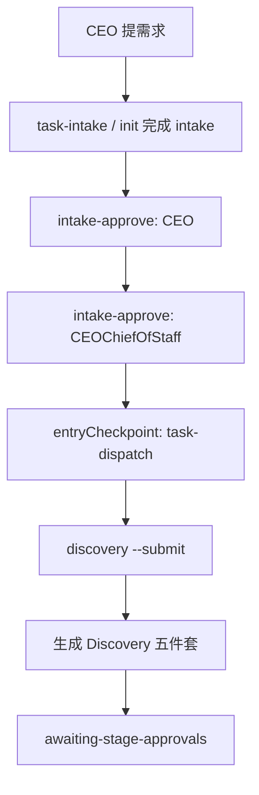

# 从 CEO Demand 到 Discovery 的产品与代码教程（小白版）

版本：V0.1
日期：2026-06-17
状态：当前可用真源（TriCompany）

## 文档同步元信息

- sourceOfTruth: TriCompany/docs/training/ceo-demand-to-discovery-beginner-course.md
- publishedFrom: 当前文件（source）
- syncMode: source-only
- publishTier: source-only
- supportPublishedCopy: 暂不发布
- supportSyncRule: 未来 TriTraining + TriAvatar + TriStaciss 模块成熟后，再评估发布到 TriMetaverse/TriTraining-copilot-host-assets
- lastSyncedAt: 2026-06-17

## 0. 方案联审结论（CPO / CTO）

### 0.1 本次确认的问题

是否可以先把“从 `ceo-demand` 到 `discovery`”的教程真源放在 `TriCompany/docs/training`，并暂不发布到 `TriMetaverse/TriTraining-copilot-host-assets`，等 TriTraining + TriAvatar + TriStaciss 成熟后再统一研究发布。

### 0.2 CPO 确认

- 结论：`APPROVE`
- 理由：当前阶段教程的首要目标是让新人准确理解真实流程和真实边界；放在 TriCompany 源侧可以保证与产品真源同步，避免先发宿主副本导致教材漂移。
- 条件：教程必须明确区分“已实现”“待验证”“后续发布计划”，不能把当前培训材料写成已发布课程体系。

### 0.3 CTO 确认

- 结论：`APPROVE`
- 理由：`ceo-demand -> discovery` 直接依赖 runtime/validation 实际行为，源侧教程更适合紧贴代码和命令更新。
- 条件：教程必须包含真实可执行命令、真实输出位置和失败排查，不要写成纯概念文。

### 0.4 总助收口

- 决策：`APPROVE`
- 执行：当前教程真源固定在 `TriCompany/docs/training`；未来是否发布到 `TriMetaverse/TriTraining-copilot-host-assets`，等三模块成熟后另开发布评审。

## 1. 这份教程教你什么

你会学会两件事：

1. 产品面：CEO 提一个需求后，怎么在 IPD 里从 `ceo-demand` 走到 `discovery`。
2. 代码面：你在本地应该跑哪些命令、会产出哪些文件、如何判断你有没有走对。

本教程只覆盖到 `discovery` 结束，不继续讲 `intelligence` 之后的阶段。

## 2. 先搞懂两个词

### 2.1 `ceo-demand` 是什么

这是“需求刚提出来”的入口状态，通常意味着：

- 你有一个方向（例如模型 API 转接平台）
- 但还没完成可签核的 intake 信息
- case 还不能直接进入产品研究包

### 2.2 `discovery` 是什么

这是“把需求变成结构化研究输入”的第一个正式阶段，至少会产出：

- 对标对象目录（catalog）
- 功能简报（functional brief）
- 对标地图（competitor landscape）
- 共性能力矩阵（capability matrix）
- 机会备忘录（opportunity memo）

## 3. 你将扮演的角色

小白第一次上手，不用同时扮演所有岗位。按最小闭环，你只要记住：

1. `CEOChiefOfStaff`：负责把需求翻译成可跑的 case，并守住边界。
2. `ChiefProductOfficer`：负责提交 `discovery` 阶段产物。
3. `ChiefTechnologyOfficer`：负责保证 runtime/validation 规则真实生效（你失败时主要看这层）。

## 4. 产品流程图（小白版）



你先把这条线跑通，就是第一阶段成功。

## 5. 代码实操（一步一步复制执行）

以下命令在 `TriCompany` 仓执行（PowerShell）。

### 5.1 看当前 case 在哪里

```powershell
python runtime\cognition\chief_of_staff_ipd_case.py status --case-id IPD-20260610-PLATFORM-001 --workspace-root "d:\OneDrive\Code\ai\TriMetaverse"
```

你要重点看：

- `status`
- `entryCheckpoint`
- `currentStageKey`
- `currentOwnerRole`

### 5.2 执行 Discovery（自动生成并提交）

```powershell
python runtime\cognition\chief_of_staff_ipd_case.py discovery --case-id IPD-20260610-PLATFORM-001 --submit --workspace-root "d:\OneDrive\Code\ai\TriMetaverse"
```

如果成功，你会看到类似：

- `automationStageKey: discovery`
- `submitted: true`
- `status: awaiting-stage-approvals`

### 5.3 看 Discovery 五件套输出

目录：

- `TriMetaverse/reference/discovery/IPD-20260610-PLATFORM-001/`

关键文件：

1. `reference-source-catalog.json`
2. `discovery-reference-functional-brief.md`
3. `discovery-competitor-landscape.md`
4. `discovery-common-capability-matrix.md`
5. `discovery-highlight-opportunity-memo.md`

## 6. 小白验收清单（必须全过）

跑完后你按这个顺序检查：

1. Case 状态是否到了 `awaiting-stage-approvals`。
2. 五件套是否都生成。
3. `LiteLLM`、`sub2api`、`OpenRouter`、`OpenAI API Platform` 是否同时出现在：
   - catalog
   - brief
   - landscape
4. `LiteLLM / sub2api` 是否不是 `manual-to-confirm` 占位口径。
5. 平台边界输入是否还在：
   - `TriAvatar README`
   - `Tristaciss Phase C ingress design`

## 7. 你最容易踩的坑

### 7.1 坑一：只看“文件生成了”就以为通过

不行。你必须看正文质量，不是只看文件存在。

### 7.2 坑二：四个 seeded competitors 名字还在，但内容退化

这会被判成 `revision-required`，不是 `pass`。

### 7.3 坑三：把内部边界输入丢掉

`TriAvatar / Tristaciss` 在这个 case 里是关键边界，不是可有可无的备注。

## 8. 你要知道的代码位置

如果你要继续深入（不是本节必须），先看两个文件：

1. `TriCompany/runtime/cognition/ipd_case_engine.py`
2. `TriCompany/runtime/cognition/chief_of_staff_ipd_case_validation.py`

你先看函数名，不用一次看完全部实现：

- `run_discovery_stage_automation`
- `_build_discovery_sources`
- `_validate_discovery_seeded_competitor_coverage`

## 9. 课程边界（避免误解）

本教程只说明“ceo-demand 到 discovery 结束”这段路径的最小可用闭环。

它不等于：

1. 整个 IPD 已跑完
2. 智能体培训体系已发布到 TriTraining 宿主资产
3. 平台已经进入生产发布

## 10. 下一步学习建议

你跑通本教程后，再进入：

1. `intelligence` 阶段输入和代码研究包
2. PRD 收口路径（CPO 主线）
3. 设计到编码阶段的证据链（CTO 主线）

## 11. Evidence Surface

- [IPD Usage Guide](ipd-usage-guide.md)
- [Discovery Replay 验证角色脚本](../workflow/agile-improvement/IPD-20260612-WORKFLOW-002/11-discovery-replay-role-script.md)
- [CTO Focused Self-Test 实例](../workflow/agile-improvement/IPD-20260612-WORKFLOW-002/09-cto-focused-self-test-001.md)
- [Discovery Replay 结果实例](../workflow/agile-improvement/IPD-20260612-WORKFLOW-002/10-discovery-replay-result-001.md)
