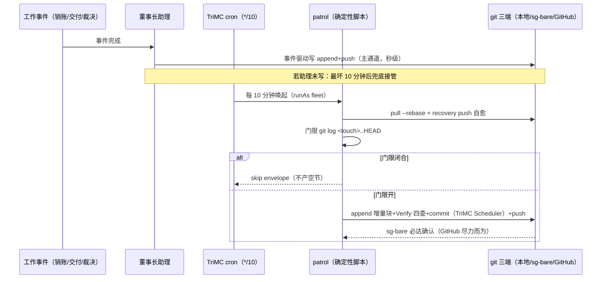

# FADE-001 周平面维护深度教程（双稿合稿定稿）

> 性质声明：本文件是 FADE-001 维护域教程的**双稿合稿定稿**（2026-08-29 董事会裁定 (a) 归一）。
> 合稿方式：双稿原版全文保全、分部并列（第一部分=本地全景篇；第二部分=sg 纵深篇），卷首给互补对照表。
> V1 核验：双稿抽查锚全过（patrol 952 行/registry L51 口径差属实/50b3024a 活体标本在卷/跨仓 hash 归属预检正确）；sg 稿自带 4 项待核验清单随第二部分保留。
> 双稿原版留档：本地稿=TriCompany 仓 d2b3846 的 fade-001-deep-dive.md；sg 稿备份=.fade/hub-snapshots/fade-001-maintenance-deep-dive-sg428.md（md5 ba2368ec…，428 行）。
> **版本差注记（2026-09-05）**：双稿事实基线=2026-08-28，拓扑叙事为 TriMC/sg 承载与 `59 23` 现役值——现势已四处超越：①迁移=周日 23:00 河源 TriRMC job 9c81c7ec（08-30）②兜底 watcher 槽位 5,15,25,35,45,55（08-31 同秒竞态消除）③2026-09-05 晨检三案未载④patrol 现行 951 行（本文写 952）。现行版四版教程见 [fade-001/](fade-001/README.md)，本文保留为历史档（函数级拆解在现行 patrol 上大体成立，接手以 03-code-map 现行锚为准）。

## 互补对照表（读前必看）

| 主题 | 第一部分（本地全景篇） | 第二部分（sg 纵深篇） |
| --- | --- | --- |
| 迁移域①十段走读 | ✅ 深读（第三/八节） | —（分工声明指向第一部分） |
| 维护域②十段 | 逐段（第四节，含拓扑门限详解） | ✅ 更深：每段"协议要求/落地形态/维护要点"三层+演进史（§一） |
| 巡检三跳弧线 | 弧线表+证据锚（第六节） | ✅ 逐跳拆到 patrol 函数行号+第 0 跳机制+教学点三则（§二） |
| shadow→gate 评分接线 | 65/80 部署日解读+两阶段（第八节） | ✅ 六步接线表+E-3 对照表+三处分叉教学含义（§三） |
| 节奏架构图/参数速查 | — | ✅ ASCII 双通道图+判定分支图+mermaid 时序+活体标本 50b3024a+参数速查表（§四） |
| D-02/D-03/D-04 对②的意义 | 误区表引用 | ✅ 三条各含"对②的意义"展开（§五） |
| 影响面与回滚方法 | — | ✅（§六，sg 稿自带章） |
| §2.7/§2.8 对照 | ✅（第九节：豁免+四不变量对照+降档范式） | 术语置换说明（§九） |
| 待核验清单 | — | ✅ 4 项随第二部分文末保留（V1 移交项） |

两部分小节各自独立编号（第一部分 §〇-十；第二部分 §〇-六）。交叉阅读按上表索引。

---

# 第一部分：全景与接手（原本地稿全文）

# FADE-001 周平面（迁移 + 每日进度维护）深度教程

> 性质声明：本篇是培训教程，不是事实裁决。教程中每一个 hash、行号、分数、时间都从仓库真源实读核验；当你发现本文与真源冲突，以真源为准，并把差异报回培训真源。
> 授课：小吴（RAndDTrainer）。事实基线：2026-08-28（W35 周平面）。

**本文引用文件与缩写对照**（均为绝对路径，正文用短名+行号）：

- `registry` = D:/Code/ai/TriCompany/docs/engineering/fade-registry.md
- `paper-①` = D:/Code/ai/TriCompany/docs/engineering/fade-papers/FADE-001-paper.json（迁移域原卷）
- `paper-②` = D:/Code/ai/TriCompany/docs/engineering/fade-papers/FADE-001-paper-maintenance.json（扩维冻结卷）
- `patrol` = D:/Code/ai/TriCompany/runtime/cognition/daily_progress_patrol.py
- `runbook` = D:/Code/ai/TriMC/docs/ops/trimc-cron-plane-shift-runbook.md
- `progress` = D:/Code/ai/TriMetaverse/docs/workflow/operating-records/2026-W35/daily-progress.md
- `review` = D:/Code/ai/TriMetaverse/docs/execution/fade-001-upgrade-review.md
- `disciplines` = D:/Code/ai/TriCompany/docs/workflow/engineering-disciplines.md
- `spec` = D:/Code/ai/TriCompany/docs/engineering/fade-protocol-spec.md

---

## 〇、培训判断与学习路径

**培训判断**：你是要接手 FADE-001 的研发新人。这个实例特殊在它刚刚完成了一次“扩维”——从一个每周跑一次的迁移脚本，长成了一个“每周迁移 + 每 10 分钟兜底巡检”的双项维护实例，并且评分体系（试卷、shadow 观测、gate 接线）正处于两阶段接线的中间态。接手它需要同时懂三件事：git 拓扑（门限口径）、TriMC cron 运维（节奏载体）、FADE 协议的评分立法（为什么 --score 现在只观测不拦截）。本文按“大结果 → 协议 → 双项十段 → 最小闭环 → 真实证据 → 故障弧线 → 评分卷宗 → 新立法对照 → 接手清单”推进。

**学习路径**（每步都有验证方式，验证不过不要往下走）：

| 步 | 读/做什么 | 验证方式 |
| --- | --- | --- |
| 1 | 读本文第一、二节，建立大图 | 能向同事口头复述“FADE-001 双项结构”与两域档位 |
| 2 | 读 registry 中 FADE-001 条目全文（registry:24-67） | 能指出①②两张十段表的位置 |
| 3 | 通读 patrol 全文（952 行） | 能说出拓扑门限、单写者、recovery push 三件事各在哪些函数 |
| 4 | 本机跑 `--self-test` 和 dry-run（第五节 MVP） | self-test 输出 `"status": "pass"`；dry-run 输出 envelope 且不写盘 |
| 5 | 读 paper-② 全卷 + run_score（patrol:603-668） | 能解读 65/80 部署日卷面（第八节） |
| 6 | 读 runbook §2/§5/§7 | 能背出部署七步里哪三步是权限修复 |
| 7 | 读 spec §2.5/§2.7/§2.8 | 能回答“为什么 push 即终态违反 §2.5” |

---

## 一、先讲大结果：FADE-001 是什么、现在处于什么档位

**一句话**：FADE-001 是 TriCompany 的“周工作平面维护”实例，2026-08-28 由 CEO 提案完成范围扩维——原来只做“周日晚上把上周 operating-records 平移进新周目录”这一件事（维护项①），现在扩为两件事，新增“每日工作进度维护”（维护项②）：在 `docs/workflow/operating-records/<ISO 周>/daily-progress.md` 里维护一个仓库级的粗粒度日进度文件，随 git 推三端（本地/sg-bare/GitHub），作为“机器全灭时的最后恢复防线”（registry:26；progress:4）。

**为什么要有②**：扩维前，最坏情况下一次工作进度的丢失窗口是 23 小时（旧日总结节奏）；②上线后是 10 分钟。重建验收场景写在 registry:60——“sg+本机+中枢三点全灭后，仅凭 GitHub 上的 daily-progress.md 可重建至最后 10 分钟”。

**当前档位（必须如实复述，这是新人最容易说错的点）**：

- 维护项①（迁移域）：完整档，首评 **PASS 90/100**（2026-08-20，必选 6/6），**冻结不重评**（registry:62；review:34）。
- 维护项②（维护域）：**扩评中**——十段已齐，Score CLI（patrol `--score`）已落地处于 shadow 首评期，Score Skill 纸面如实（registry:54,63）。
- 整体档位判定 = **两域双门槛各自 PASS 的合取**（paper-②:85-88，CPO 域级分卷采纳）；不以①完整宣称整体完整（registry:63）。

**节奏一句话**：② 的运行节奏是“事件驱动主 + 10 分钟兜底”——董事长助理在销账/交付/裁决后随手 append+push（主叙事，语义质量高）；TriMC cron 每 10 分钟跑一次确定性巡检脚本 patrol，发现进度文件落后就补写（registry:47）。两者遵守单写者原则，互不重写对方内容。

---

## 二、协议方法层：十段框架与本文要用的协议条款

FADE 协议的生命周期十段是：事件触发 → 登记（运行标识）→ Qualify → Plan Skill → DCE → Verify(可选) → Score CLI → Score Skill → Close Skill → Close CLI → 终态（spec:63-77 生命周期图；spec:95 完整实例定义）。三条对本文最要紧的协议条款：

1. **双门槛**（spec:183）：及格 = 必选项全部通过（Score CLI 确定性判定）且总分达标；不达线进 RETRY/ESCALATED，不得写入终态。
2. **§2.5 终态门**（spec:168-174）：Close Skill 先出语义裁决，Close CLI 校验后才写终态；“位于 Close Skill 之前的 CLI 只能称为 DCE、Verify CLI、Score CLI 或 evidence finalizer，不能提交不可逆终态”（spec:173）。
3. **§2.8 段-实现绑定**（spec:225-266）：立法原则一句话——“协议管不变量，实例管载体”（spec:227）。登记段的四不变量是唯一性/去重性/关联性/恢复锚（spec:241）；实例入册声明“段-实现映射表”，最小 schema 三字段（spec:258）。

两个 profile（spec §八）里，FADE-001 两个维护项都属 **runtime-owned durable**（spec:412-430）：cron/watcher 触发、runtime 持有生命周期。①的触发器是 cron，②的兜底腿也是 cron——这正是 §7.3 表格里“watcher、Git hook、cron、CI 触发 → 不足以由 standalone Skill 持有生命周期 → 应使用 runtime-owned profile”的标准案例。

---

## 三、维护项①（周平面迁移）：十段逐段落地形态

①的工件表在 registry:28-36，规范文件是 runbook（registry:38 指定）。逐段讲：

**1. 事件触发**：TriMC cron。注意一个**新人必踩的坑**：registry:30 写的是 `0 23 * * 0`（周日 23:00 Asia/Singapore），这是历史叙事口径；runbook:18 给出现役真值 `59 23 * * 0`、timezone `Asia/Shanghai`（周日 23:59 北京时间），runbook:165 明确解释了这个已知漂移——CLI 预设 `0 23` vs 现役 job 2026-08-16 手调成 `59 23`，且“历史文档按叙事冻结不改”。**运维时以 `trimc cron list` 输出为准，不要信文档里的表达式**。jobs.json 持久于 `/var/lib/trimc/cron/jobs.json`（runbook:25）。

**2. 登记**：jobId + per-run 日志 `/var/lib/trimc/cron/logs/<jobId>__<ISO>.log`，去重=调度引擎防重入（registry:31）。注意 runbook:71 的口径坑：引用 job 必须用 36 位完整 UUID（如周迁移 job `b00b0070-2f82-4e7d-a98c-de73e886834b`），截断形式查不到 job。这个载体形态被 spec:253 点名为合法登记载体示例：“jobs.json jobId + per-run 日志（周迁移）”。

**3. Qualify/Plan Skill**：五段链脚本内置，迁移段序固定：OP index → unresolved → trees → carry-over → 通知，“无需逐次语义规划”（registry:32）。注意“五段链”有两个视角：语义序（上面这个）和脚本五步 `create/migrate/carry_over/validate/agent_close`（paper-①:46）。Plan 是静态固化的——同②的模式，这是“维护类实例 Plan 段=静态计划固化”的共同形态。

**4. DCE**：`python3.8 五段链 --sync`，runAs fleet，写 operating-records，git commit（内联身份 TriMC Scheduler）+ push `/srv/git/TriMetaverse.git HEAD:dev`（registry:33；runbook:19-22）。两个硬约束：解释器必须是 **python3.8**（服务器系统 python3.6.8 不兼容新语法，runbook:27）；脚本幂等——“create already_exists 不失败、carry_over 目标存在即 skip，修正后直接重跑”（runbook:93）。

五步链逐步走读——一轮 `--sync` 在 `.shift-ade.json` 里落成 `steps[]` 五步，步名与字段合同出自 paper-①:46（每步必含 `status/result/changes/errors/check_time`）：

```text
create       建新周平面骨架（OP-YYYYMM-Wnn-001.json 周索引、unresolved-items.md 等，paper-①:64）；幂等：already_exists 不失败（runbook:93）
migrate      周平面平移：上周 OP index/unresolved/trees 语义段（registry:32）迁入新周，changes 记 created/retired/migrated 对照（paper-①:55）
carry_over   未结项挂账迁移 + escalation_8w 阈值上报（含 CARRY-* 明细，paper-①:73）；幂等：目标存在即 skip（runbook:93）
validate     链内校验步：五步结果在此汇成可断言结构——解析 .shift-ade.json 逐项断言的评分素材即源于此（paper-①:46）
agent_close  收口步：Close 判定落卷，终态样本=.shift-ade.json status=pass + 落盘文件 + commit 三方一致（paper-①:58-65）
```

五步各自的 `changes`（before/after 对照）与 `check_time` 时间戳就是 paper-① 的 audit-record 评分项（10 分，paper-①:50-55）——读一份 `.shift-ade.json` 先看这两个字段。

> 新人提示：先在测试根走 dry 链再碰真迁移——`python3.8 -m runtime.cognition.weekly_plane_shift --from W33 --to W34 --start-date 2026-08-17 --operating-root <测试根> [--sync]`（runbook:57-59）；真跑失败不回滚代码——脚本幂等，修正后直接重跑（runbook:93）。

**5. Verify**：①的登记表（写于前标准期）没有单列 Verify 行——链内 `validate` 步承担校验。这是“前标准期实例”的形态：registry:17 注记 FADE-001..004 属四模块架构成立前登记，按 CEO 裁定不追溯降格，但须对照新规补课。教学上要如实：不要替它脑补一个不存在的独立 Verify CLI。

**6/7. Score CLI / Score Skill**：①的评分是 2026-08-20 首评：对卷 paper-①（threshold 80，paper-①:5）得 **PASS 90/100、必选 6/6**（registry:62），遗留“服务器侧 jobs.json/per-run 日志回流后复评”。这次评分属回溯建卷口径——评分动作对真实 run 复算，而非每次 run 内嵌评分（后者是②正在走的新立法路径）。

**8. Close Skill**：迁移完成后邮件通知语义摘要——notify.json 0600 + QQ SMTP，2026-08 演练二期实证真实投递（registry:34；runbook:28，审计以 .shift-ade.json + git commit + per-run 日志为主、邮件为补充）。

**9. Close CLI**：`.shift-ade.json` 审计文件 + git commit 哈希为确定性收口载体（registry:35）。五步每步含 `status/result/changes/errors/check_time`，changes 含 before/after 对照（paper-①:46,53-55）。

**10. 终态**：实跑样本 W33→W34 迁移（2026-08-17 由服务域 TriMC 独立完成，registry:36），W34→W35 于 08-24 自然触发（review:36）。

**运维必背**（runbook §2 部署七步里的三个权限修复，每次 pull/push 后可能复发）：`.git` 属主修正 `chown -R fleet:fleet /srv/fleet/TriMetaverse/.git`（runbook:34-36，root pull 后常态复发）；裸仓 loose 目录 `g+w`（runbook:37-39）；fleet `safe.directory` 全局登记（runbook:40-41）。异常对照表在 runbook:88-97，演练回退“无痕四件套”（裸仓 ref/舰队克隆 HEAD/job 态/本地 HEAD）在 runbook:107-125。

---

## 四、维护项②（每日工作进度维护）：十段逐段落地形态

②的十段表在 registry:45-57，执行体是 patrol 全文（TriCompany runtime/cognition/daily_progress_patrol.py，952 行，纯确定性无 LLM）。先讲节奏设计，再逐段落地。

### 4.1 节奏：事件驱动主 + 10 分钟兜底 + 单写者三原则

设计注册分两步：十段设计 ea64927（runtime-owned durable profile，探索期手动/自动化期 cron 两阶段），节奏重设计 49287fc（CEO 纠正：“第六源是恢复兜底不是日总结”），两 commit 均见于 progress:43 的当日 registry 提交列表。

- **主=事件驱动**：助理销账/交付/裁决后随手 append+push——因为“哪件事值得记、怎么概括”是语义判断，写的人质量最高。
- **辅=定时巡检**：cron `*/10`，job `d0f87756-e941-4984-9919-1993028566bc`，Asia/Shanghai，runAs fleet（progress:18）——因为人会忘，确定性脚本不会；最坏丢失窗口 23h→10min（progress:18）。
- **单写者三原则**（patrol 文件头 docstring patrol:5-8, 21-24）：
  1. 助理主叙事：权威叙事在 ledger-mirror/董事会记本（机器本地不入仓），daily-progress 是粗粒度镜像（progress:3,29）；
  2. patrol 只 append 不重写：写入只开 append 句柄（patrol:420-428），T4 评分项直接机器检查“patrol 身份提交补丁零删除行”（patrol:546-554）；
  3. 冲突跳轮：与助理写冲突时 `pull --rebase` 重试一次，再失败**跳过本轮、下轮再补**，不算 cron 失败（patrol:119-130 attempts=2；patrol:362-370 返回 skip envelope）。

### 4.2 十段逐段

**1. 事件触发**：如上双通道。脚本入口三种模式：默认 dry-run / `--sync` 写入 / `--self-test`（patrol:31-33, 909-947）。

**2. 登记**：运行标识=日期锚 `## YYYY-MM-DD（周X）`；去重=同日标题已存在则 append 不新建（registry:48）。实现上 `day_section_index` 用**日期前缀匹配**而非全标题匹配——星期标签误标变体不会触发重复建节（patrol:95-98；自测 Case H patrol:775-778）。持久=git 三端。

**3. Qualify（机械门）**：当日确有运行变化，拓扑口径——“自上次进度条目后新 commits>0”（registry:49）。实现是 `commits_since(repo, base_full)`，核心一行 `git log ... "<base>..HEAD"`（patrol:177-208，拓扑表达式在 patrol:186）。无变化返回 skip，**不产空节**（patrol:394-395）——skip 是合法终态不是失败。曾设计的 ledger-mirror mtime 分支被 2026-08-28 升档联审裁定删除：“未实现未接线的纸面设计=审计负债；设计史留 patrol docstring”（registry:49；patrol:18-19）。为什么删？因为服务器巡检读不到 `.fade/`（gitignore，patrol:14-16），一个永远走不到的分支留在代码/文档里会误导审计者。

**4. Plan**：静态计划固化于脚本。增量块格式固定三件：补写行（时刻+基线短 hash+N 条 commit）→ commit 清单（默认上限 15 条）→ registry 行（版本+当日 registry 提交）（`build_increment` patrol:246-258；`build_day_section` patrol:261-278）。

**5. DCE**：`patrol_once` 一轮全流程（patrol:352-466）：pull --rebase → **recovery push 自愈** → 读门限 → 收集 registry 快照 → 组块 → 写入。四个关键设计：

- **recovery push（防死锁）**：上轮 push 失败遗留的未推提交，在下轮开头先重推。否则“文件已被自己触碰→门限闭合→永不重推”死锁（patrol:22-24 docstring；实现 patrol:372-379）。
- **写入即回滚保护**：写入前存 `pre_bytes`，verify 失败或 commit 失败就回滚到写前状态（patrol:430-451）。
- **push 分级**：sg-bare 必达——失败不伪造终态，envelope 记 fail，commit 留在舰队克隆等下轮自愈（patrol:453-458）；GitHub best-effort——服务器无凭据，`GIT_TERMINAL_PROMPT=0` 快速失败禁挂起（patrol:101-104；patrol:460-464）。
- **身份**：commit 内联 `TriMC Scheduler <trimc-scheduler@fleet.local>`（patrol:57-58）——这个身份是 Score CLI 区分“巡检写”与“事件写”的判据（patrol:612-613）。

**6. Verify**：写入后回读自检 `verify_day_section`：当日节存在且非空、本次追加块在卷、锚点格式合规（patrol:281-299）。失败即回滚+fail envelope（patrol:438-442）。

**7. Score CLI**：patrol `--score`，一具两段（Score 与 Verify 复用同一解析助手，防 §7.4 双实现——review:53）。五约束 + shadow/gate 两阶段，见第八节。

**8. Score Skill**：**待实现**（registry:54，纸面如实）。已圈定范围：T3（事件驱动及时性，commit/msg 时戳对照+双席抽验）与 T7（治理对齐：触发权董事会/执行 patrol/助理主叙事 + trimc jobCount 健康 + D-02 nextRun 保持）留 Skill，CLI 禁自动化（paper-②:34-41,64-70；约束 1 patrol:470）。

**9. Close Skill**：董事会/助理确认当日节完整（registry:55）。扩维裁定的立法方向：Close Skill 轻量独立化——事件驱动写内嵌语义判定 + 评分达标程序化判定三态（通过/RETRY/ESCALATED，引用评分证据）（registry:66）。

**10. Close CLI**：现行载体=“push 三端成功即终态（任何一端可达=每日进度不灭）”（registry:56）。**但联审已裁定这个时序违规 §2.5**：升完整后时序必须 DCE(push)→Verify→Score→Close Skill→Close CLI，现行“push 即终态”违反 §2.5；Close CLI 拆段=push 业务持久化【部分】降档如实（registry:66）。这是新人必须知道的“已知债务+已立法修复路径”，不是可以忽略的历史遗留。

**终态**：当日节在三端仓库可读——机器全灭时的日级重建锚（registry:57）。

### 4.3 拓扑门限详解（本实例最重要的一个技术点）

门限要回答的问题：“进度文件最后一次被触碰之后，仓库有没有新 commit？”第一版实现用“时间戳严格大于”（commit 时间 > 文件最后触碰时间）。20:20 巡检一轮 skip 实测抓出缺陷：**rebase 连发使 marker 提交与进度提交同秒**，同秒提交被“严格大于”漏计，门限误闭合（patrol:180-182 docstring 原话记录了这次实测缺陷）。修复=改拓扑口径 `git log <touch_full>..HEAD`（patrol:186）——git DAG 的可达性天生没有“同秒”问题，变基重写也不影响。修复同时留下回归用例：自测 Case I 用 `GIT_COMMITTER_DATE`/`GIT_AUTHOR_DATE` 固定同秒造两个提交，断言拓扑门限全部计入（patrol:784-802，I1/I2）。

**教训一句话**：顺序/计数类判定用 git 拓扑（DAG），不用墙上时钟——时间戳秒级粒度+变基重写都是它的判据盲区。这与 D-04 时刻纪律“禁止从上下文时间戳外推”（disciplines:37-41）是同一价值观在代码层的投影。

---

## 五、最小闭环 MVP：新人上手跑一遍（不碰生产）

patrol 默认路径指向服务器舰队克隆（`DEFAULT_TMV_REPO=/srv/fleet/TriMetaverse`，patrol:72-73），本机演练要么读代码，要么用参数覆盖到沙箱目录。**第一课只跑前两个命令**：

```bash
cd D:/Code/ai/TriCompany
python -m runtime.cognition.daily_progress_patrol --self-test   # 内置验证套件（沙箱 git 仓，不动真仓）
python -m runtime.cognition.daily_progress_patrol               # dry-run：只读，不 pull 不写不推
```

- `--self-test` 沙箱自建 bare+repo+tco 三仓（`_init_sandbox` patrol:674-689），跑 Case A（门限闭合→skip）/B（marker→written+当日节自动建）/C（自写后门限闭合，无自激循环）/D（二次增量 append 不重写）/E（verify 负例）/F（registry 解析）/G（dry-run 只读）/H（误标容错）/I（同秒回归）/S（score 沙箱含 T4 负例）——**30/30 过**（升 --score 后从 21 项扩到 30 项，progress:18,24）。输出 `"status": "pass"` 即通过；退出码 1=有 fail（patrol:35, 906）。
- dry-run 输出 envelope，`status=would-write` 时 `details.would_write_first_line` 给出将写入的首行预览（patrol:414-418）；`status=skip` 表示门限闭合。

服务器侧（只读观察起步）：`/var/lib/trimc/cron/logs/<jobId>__<ISO>.log` 是巡检 stdout envelope 的落盘处（patrol:26-28）——这是 FADE spec §九.4“sync-log 或等效审计日志”的等效载体。`--sync` 只应出现在服务器 fleet 环境下由 cron 拉起，**新人不要手动在服务器点火**（要验链路用 `npx tsx src/cli.ts cron run <全量UUID>` 幂等兜底，runbook:66-69）。

评分模式演练：

```bash
python -m runtime.cognition.daily_progress_patrol --score --date 2026-08-28
```

输出 shadow 评分 envelope（只观测，不写任何东西）。怎么读它，第八节讲。

---

## 六、本周真实运行证据（W35）：巡检三跳弧线 + 里程碑锚点

以下时间线全部来自 progress:18-19,41-46 与 registry:63-65 的实读核验（hash 均在两份以上文件交叉出现）。

**部署（08-28 傍晚）**：patrol v1.0 落 TriCompany（fbadf21/bfad13f，内置自测 21/21）+ trimc cron job `d0f87756-...` 注册，nextRun 落 20:10 +08（progress:18）。

**三跳弧线**（progress:19 原文记录）：

| 时刻 | 事件 | 证据锚 |
| --- | --- | --- |
| 20:10 | 首跳真实触发：门限开（触发 commit=83753b74，fade-007 恢复配方补第 6 源），补写落地 2014ef40；误标节容错识别生效 | progress:19,41-43（补写块原文：“自上次进度提交 17a4af84 后新增 1 条 commit：83753b74”） |
| 20:20 | 第二跳 skip——**skip 实测抓出门限同秒缺陷**（rebase 连发致 marker 与进度提交同秒被“时间戳严格大于”漏计） | progress:19；patrol:180-182 |
| 修复 | 拓扑门限 `git log <touch>..HEAD`，3082d7d 落地，含回归 Case I | patrol:186,784-802；review:20 |
| 20:30 | 第三跳精确补写：c9300421 补写 marker 8ad1ab4a（20:30:06 检出，**6 秒闭环**） | progress:19,44-46 |

注意 progress:19 结尾那句：“本销账行即事件驱动主第二次执行”——销账动作本身随手 append 进度文件，就是事件驱动主通道在跑。这就是“事件驱动主+兜底辅”在真实一天里的样子。

**GitHub 失败收敛实例**：20:10 巡检 GitHub push 失败（服务器无凭据，设计内），随后事件驱动写把三端补齐——“任何一端可达=每日进度不灭”口径的实测（review:26-27）。ls-remote 三端 tip 一致实证锚=ce3ad83f（review:19,23）。

**立法锚点（同日）**：十段设计注册 ea64927、节奏重设计 49287fc（progress:43）；备料包 b98ea91d（review 全文，progress:23）；升档裁定落地 TCO d0cb4d9+6d42612（扩维卷冻结+registry 立法包，progress:24；其内容与 registry:63-67 逐项对得上，可交叉验证）。

**跨日行为样本**：08-29 00:00 巡检在前一日晚间提交 caeec035（基线 c9770a36 之后）落入新一日节并自动建节（progress:47-52）——`week_relpath` 按 ISO 周推算路径（patrol:85-88），跨日/跨周都不需要人工干预。

---

## 七、故障弧线与教训（关联 D 系工程纪律）

**弧线 F1：W34→W35 迁移落旧基（①域，已立纪律）**。本地超前 101 commit 未推 → 迁移 commit 落在旧基 `ae3d32fe` → 回流被迫 merge + W34 index 冲突人工裁定 + W35 台账漏登 2 树（08-24 补全）（runbook:167）。产出的纪律：**迁移冻结窗口**——周日 23:00 北京时间前 operating-records 全部 commit 并推 sg-server，23:00 至周一回流完成期间冻结本地对 operating-records 的一切写入；姊妹条=周日全仓推送软习惯（runbook:167-168）。教训本质：迁移的 DCE 是确定性脚本，但它的输入基线不是确定性保证的——输入纪律必须由人来守。

**弧线 F2：20:20 同秒门限缺陷（②域，修复+回归）**。见 4.3 节。教训：时间戳当判据、拓扑当证据；缺陷被“skip 实测”抓出而非靠 review——**让系统跑起来观察它，比读代码更能暴露门限类缺陷**。

**弧线 F3：GitHub push 恒失败（②域，设计内边界）**。服务器巡检无 GitHub 凭据，push best-effort（patrol:460-464）。配套设计：T5 评分项“离线=不可验非 FAIL”（约束 2，patrol:471；paper-②:49-56）、GitHub 最终一致容差 ≤24h、收敛由事件驱动写兜底（paper-②:52-54；review:27）。教训：**失败要分“设计内降级”与“设计外故障”**，评分体系要给前者留“不可验”态，否则兜底通道会被误判为持续 FAIL。

**弧线 F4：recovery-push 死锁（②域，预防性设计）**。如果上轮 push 失败后不先重推，本轮巡检补写会把门限重新闭合，未推提交永远滞留（patrol:22-24）。教训：自愈逻辑要检查“自己上轮的遗留状态”，不是只看外部世界。

**弧线 F5：LG-012 restart 触发 TriModel dist 潜伏损坏（同日关联故障）**。TriMC cron CLI 补 X-Internal-Token 头当日闭环后，restart 触发 dist 丢失崩循环，21:08-21:11 如实入账后重建修复（progress:20）。复盘进 **D-03 v3**：dist 形态服务（gitignored 构建产物）restart 前置检查必须含 dist 完整性 + node_modules 符号链接目标存在性；对 gitignore 构建产物仓做 reset/re-checkout 后必须重建 dist——“旧进程内存存活会长期掩盖潜伏损坏”（disciplines:33）。

**弧线 F6：mtime 纸面设计的审计负债（②域，制度教训）**。ledger-mirror mtime 门限分支曾进 49287fc 设计，升档联审裁定删除——服务器根本读不到 `.fade/`，这个分支永远不会执行（patrol:14-19；registry:49）。这与 spec 细则 10“接线+实测才算立法完成，未接线的法条一律标注纸面法”（spec:266）同源：**设计史可以留 docstring，现行文档里不留给未实现分支任何“已设计”的暗示**。

---

## 八、评分卷宗解读

### 8.1 迁移域原卷（paper-①，已评结）

结构：10 检查项 × 权重 10 = 100，threshold **80**（paper-①:5），其中 6 项必选（trigger-config / run-id-carrier / skill-docs / cli-report / audit-record / terminal-sample，各 paper-①:13-65）。卷 notes 明确证据充分性口径：服务器侧 jobs.json/per-run 日志/邮件投递日志本机不可得，“以 runbook 文档级证据计分并如实扣分”（paper-①:8）。首评 **90/100、必选 6/6**（registry:62），扣掉的 10 分对应哪一项卷内可复算。遗留：服务器侧证据回流后复评——这项挂在 registry:67 齿条①，**09-17 四周警告线前必须动**。

### 8.2 维护域扩维卷（paper-②，冻结未达标结算）

先看冻结三要素（paper-②:6-11）：冻结点=**载体定版 commit 同盘**（裁定：patrol `--score` 落地=载体定版）；算法=`_fadehash.dual_sha256` canonical（raw+LF 双 hash，行尾漂移按 SOFT-DRIFT 留痕）；双 hash 值记在冻结 commit 消息与登记册条目，**不入卷内防自引用**——卷值 raw=lf=`82e34df7f16e4deda266b7c8106ded0c2eddec1e85e4729db70bb35194524153`（registry:64；progress:24），raw 与 LF 相等=卷纯 LF 无漂移。这正是 spec v2.0.3“试卷 Plan 时点冻结”立法（spec:187-193）的实例化：②为静态固化 Plan（无逐次 Plan Skill），所以冻结时点取 Score 载体落地 commit 同盘，首个维护域评分 run 收口对卷（review:79）。

**scoreable run 定义**（paper-②:12；约束 3 patrol:472）：自然日含事件驱动写与巡检补写**各≥1**；skip-only 轮不可评分。run_score 里的判据就是“当日 patrol 身份提交与事件身份提交都非空”（patrol:612-614），不满足时 envelope 给 `status=not-scoreable` 并带 reason（patrol:643-647）。举例：08-28 事件+巡检都有，scoreable；08-29 只有 00:00 一次巡检补写，在事件写发生前是 not-scoreable。

**T1-T8 权重表**（paper-②:17-78）：

| # | 检查项 | 权重 | 判定载体 | CLI 实现锚 |
| --- | --- | --- | --- | --- |
| T1 | 当日节结构齐备（存在+星期标签合规+节非空） | 15 | Score CLI | patrol:489-507 |
| T2 | 巡检兜底及时性：触发→下一次文件触碰 ≤780s | 15 | Score CLI | patrol:510-543 |
| T3 | 事件驱动及时性（销账/交付与状态条同 batch） | 10 | Score Skill（约束 1） | — |
| T4 | 单写者纪律：patrol 补丁零删除行（append-only） | 15 | Score CLI | patrol:546-554 |
| T5 | 三端持久（ls-remote 对账；GitHub 容差 ≤24h） | 10 | Score CLI | patrol:557-573 |
| T6 | 门限正确性（全文件日节零空节+提交消息格式合规） | 15 | Score CLI | patrol:576-593 |
| T7 | 治理对齐（分权制+jobCount+D-02 nextRun 保持） | 10 | Score Skill（约束 1） | — |
| T8 | 巡检脚本载体质量门（self-test 全过+无 LLM） | 10 | 自测输出+代码抽验 | patrol:596-600 |

双门槛：必选全过 + 总分 ≥90（定值=对齐①90 分档位带，paper-②:80-84）。**CLI 小计 80 + Skill 外部 20 = 100**（`SCORE_WEIGHTS` 小计 80 / `SCORE_SKILL_EXTERNAL={"T3":10,"T7":10}`，patrol:67-68）——这就是“扩评中”的数学含义：CLI 满分也只有 80，<90，**必须等 Score Skill 实跑才能上 90 线**。

**T2 的量化与基线**（本卷最容易误读的一项）：780s = tick 600 + timeout 180（`TICK_SECONDS=600`/`JOB_TIMEOUT_SECONDS=180`/`T2_MAX_GAP`，patrol:64-66；paper-②:29）——兜底义务的物理上限就是“一个调度周期+一次 job 超时预算”。基线规则=仅计**当日首次文件触碰之后**的触发，建档前无兜底义务（patrol:512-514；paper-②:31 boundary）；触发后尚未到下一 tick 或跨日的计 pending 不计违规（patrol:536）。

**部署日 65/80 的如实解读**（registry:65；progress:24）：08-28 shadow 校验得分 65/80。算术：80−15=T2 唯一违例，即 T1(15)+T4(15)+T5(10)+T6(15)+T8(10)=65 全过。唯一违例锚=**83753b74**：该 commit 落在 20:10 部署之前，当天 patrol 尚不存在，触发→补写间隔必然超 780s——这是**部署日 regime 边界**（系统上线当天，上线前的触发无兜底义务），处置=留 Score Skill 注记、不在 T2 重复扣分（paper-②:31）；随后 T2 首触基线规则在 shadow 观测期内落地为代码（patrol:512-514），让这类边界从“违例”变为“不计入”。**教学要点：65/80 不是“系统差 25 分”，而是“新卷首日观测 + 一条已被裁定为 regime 边界的违例”**——读评分卷宗必须先读 boundary 字段再读分数。

**shadow→gate 两阶段**（paper-②:13-16；约束 4 patrol:473）：首评期 `--score` 只观测不拦截（shadow envelope 留痕，envelope 里 `gate_wired: false` 写死，patrol:661）；试卷冻结+双门槛达标后，push 终态门接 score（不达标不 push、RETRY 留痕）——**接线时点=扩评达标日**。也就是说今天你跑 `--score`，它永远不会阻止你任何事；它“达标”的那一天，才会变成 push 前的硬门。

---

## 九、与 FADE 协议 v2.0.0 新立法（§2.7/§2.8）的对照

### 9.1 §2.7 节点收口报告：豁免，但有精神等价物

§2.7 立法动机来自 FADE-006 的过程黑箱缺口：多节点树里每个节点完成时必须在 `reports/node-<NODE-ID>.md` 落十字段收口报告，配 `node-report-check` 校验器与编排双门（spec:195-223）。**FADE-001 在补课范围裁定中被豁免**：节点收口报告仅适用多节点树实例——“001/002/003 单段脚本/CLI 实例豁免，004 HTTP 链多节点按段适用”（registry:17，联审 CPO-F16）。理由：①的一次 run 是一条五步链脚本，②的一次 run 是一轮 patrol——没有“节点”可拆。

但②有两个精神等价物，新人要能指认：

1. **每轮审计 envelope**：patrol stdout 结构化 JSON 由 trimc cron per-run 日志落盘，patrol docstring 自认这是“FADE §九.4 sync-log 或等效审计日志的等效载体”（patrol:26-28）；
2. **daily-progress 当日节本身**：按时间锚聚合“当日发生了什么（commit 清单+registry 变化）”，格式固定、可机器校验（T1/T6 就是在校验它）——功能上接近一份“日级收口报告”的叙事面，只是粒度是日而非节点。

### 9.2 §2.8 段-实现绑定：FADE-001 是“协议管不变量、实例管载体”的活教材

登记段四不变量（spec:241）在两个维护项上的载体对照：

| 不变量 | ①载体 | ②载体 |
| --- | --- | --- |
| 唯一性 | jobId（36 位 UUID） | 日期锚 `## YYYY-MM-DD`（同日单节） |
| 去重性 | 调度引擎防重入（runningAtMs 守卫，runbook:92,171） | `day_section_index` 同日已存在则 append 不新建（patrol:95-98） |
| 关联性 | per-run 日志按 jobId 聚合五步链 | 当日节聚合全部补写块+registry 快照（patrol:246-258） |
| 恢复锚 | `.shift-ade.json` + 迁移 commit | 三端可读的当日节（机器全灭日级重建锚，registry:57） |

①的载体形态被 spec:253 逐字点名为合法登记载体示例（“jobs.json jobId + per-run 日志（周迁移）”）。registry v1.2.1 注记已把本册十段工件表 schema 化为“段-实现映射表”（registry:19），最小 schema 三字段=段名/载体类型与形态/不变量满足证据引用（spec:258）；FADE-006 已完成映射表首行填制（registry:155-170），FADE-001 的正式映射表挂在其升完整路径上——现状①②两张表（registry:28-36,45-57）已是映射表的内容形态，升档时按三字段补齐证据引用即可。

**Close CLI 载体的诚实降档**是 §2.8 时代最值得学的表态范式：FADE-006 对 Close CLI 载体做了三态声明（“matcher 载体=已接线 / 例行化宽口径=核验中”，registry:168）；FADE-001② 同样把现行“push 即终态”如实降档为“push 业务持久化【部分】”，并立法升完整前置=收口登记载体（run-root 式清单 hash 或当日节收口行+registry 台账，v2 schema 复用零新工具）（registry:66）。**模式：不达标不隐瞒，声明三态+写明解除条件**。

**细则 10（spec:266）视角的②现状**：接线+实测才算立法完成。②的 Score CLI 已接线已实测（部署日 shadow 65/80 是真实 run 的观测）；Score Skill 纸面（registry:54）→ 属“纸面法”治理对象，登记册“纸面法清单”当前空清单开局（registry:172-178），②的纸面项在条目内以“扩评中”标注、周检核对。齿条两项盯紧：①迁移域服务器回流复评（09-17 警告线）②run↔段索引现场化——下个维护 run 起，不事后补（registry:67；review:69）。

---

## 十、接手任务清单

**读什么**（顺序）：registry FADE-001 条目 → patrol 全文 → paper-② → runbook §2/§5/§7 → spec §2.5/§2.7/§2.8 → review（理解扩维裁决从哪来）。

**跑什么**：第五节两条命令；`--score --date <昨日>` 看真实卷面。

**改哪里**：patrol 单文件即②的全部 DCE/Verify/Score CLI 载体；改完必须 `--self-test` 全过（T8 是评分项，patrol 改版后 T6/T8 复验不自动废卷，paper-②:76）。

**验证方式**：本地改动 → TriCompany 仓 commit → 服务器 `/srv/fleet/TriCompany` pull（代码修改一律本地发起：本地→裸仓→舰队克隆，runbook:169）；巡检 envelope 看 `/var/lib/trimc/cron/logs/`。

**常见误区表**（每条都有真实事故/裁定背书）：

| 误区 | 真相与锚 |
| --- | --- |
| 信 registry 里的 cron 表达式 `0 23 * * 0` | 现役 `59 23 * * 0` Asia/Shanghai，历史文档叙事冻结（runbook:18,165） |
| 用截断 UUID 查 job | 必须 36 位全量 UUID（runbook:71） |
| 手动改 cron state 时抹掉 nextRunAtMs | 引擎靠它排期，缺失=永不调度（D-02，disciplines:23-25；T7 评分项盯它） |
| 把 self-test 30/30 说成“Score 实跑通过” | 自测=载体构建质量门，Score=对真实 run 的评分，禁混同（review:10,51；paper-②:89） |
| 把 65/80 当“系统不及格” | CLI 小计上限 80；T2 违例系部署日 regime 边界已裁定注记（registry:65） |
| 在服务器手动 `--sync` 试运行 | 只用 cron 自然触发或 `cron run <全量UUID>` 幂等兜底（runbook:62-69） |
| 给 patrol 加 f-string/match 或假设 GitHub push 必达 | 服务器 python3.8 约束（runbook:27）；GitHub=best-effort，失败属设计内（patrol:460-464） |
| 报时直接减 UTC 与北京读数 | 换算一次、单一时区帧内比较（D-04 v3，disciplines:41）；envelope check_time 走 UTC Z、人读轨走 +08（D-04 v4，disciplines:43-46） |

---

## 使用依据

- D:/Code/ai/TriCompany/docs/engineering/fade-registry.md（FADE-001 条目 24-67 行：①十段表+②维护项②十段表+扩维块/Score 五约束/Close 立法/齿条；v1.2/v1.2.1/v2.0 注记）
- D:/Code/ai/TriCompany/docs/engineering/fade-papers/FADE-001-paper-maintenance.json（扩维冻结卷全文：freeze/scoreable/T1-T8/threshold/transfer_domain/honesty）
- D:/Code/ai/TriCompany/docs/engineering/fade-papers/FADE-001-paper.json（迁移域原卷：threshold 80、十检查项、notes）
- D:/Code/ai/TriCompany/runtime/cognition/daily_progress_patrol.py（全文 952 行：拓扑门限 177-208、单写者 119-130/362-370、recovery push 372-379、Verify 281-299、Score 五约束 469-474、T1-T8 489-600、run_score 603-668、自测含 Case I/S 784-883）
- D:/Code/ai/TriMC/docs/ops/trimc-cron-plane-shift-runbook.md（§1 架构/§2 部署/§3 装 job/§5 异常/§7 纪律：冻结窗口 167、时区口径 165、job UUID 71）
- D:/Code/ai/TriMetaverse/docs/workflow/operating-records/2026-W35/daily-progress.md（里程碑 1-16、三跳弧线 19 行、20:10/20:30 补写块 41-46、08-29 跨日节 47-52）
- D:/Code/ai/TriMetaverse/docs/execution/fade-001-upgrade-review.md（十段三态表/缺口 7 项/Score 载体方案/试卷草案/自检）
- D:/Code/ai/TriCompany/docs/workflow/engineering-disciplines.md（D-02/D-03 v3/D-04 v3-v4/D-10 等）
- D:/Code/ai/TriCompany/docs/engineering/fade-protocol-spec.md（§2.5 终态门 168-174、§2.6 试卷冻结 187-193、§2.7 节点收口报告 195-223、§2.8 段-实现绑定 225-266、§8.1 profile 412-430）


---

# 第二部分：维护域②纵深（原 sg 姊妹稿全文）

> 合稿注：本部分 §〇 的"分工声明/学习路径"保留原稿口径；其中"姊妹篇=/srv/fleet/.../fade-001-deep-dive.md"即卷首第一部分（本合稿内直接上翻）。


# FADE-001 周平面维护深度教程

> 性质声明：本篇是培训教程，不是事实裁决。文中每个 hash、行号、分数、阈值都来自本实例开工时的现场实读；发现本文与真源冲突，以真源为准，并把差异报回培训真源。
> 授课：小吴（RAndDTrainer）。事实基线：2026-08-29（W35），工作树 HEAD 基线=TriMetaverse 50b3024a2c07b70d1b1e191997134cff6d2160c6（编排层开工实测）。
> hash 归属声明：TriMetaverse 仓 2014ef40/c9300421/8ad1ab4a 为 commit、TriCompany 仓 3082d7d/fbadf21/bfad13f 为 commit——均沿用编排层 `git cat-file` 机械预检结论（本教程写作会话内出具）。

**本篇引用文件与缩写对照**（绝对路径，正文用短名+行号；行号对应当前读到的版本，后续版本行号可能漂移，以文件为准）：

- `registry` = /srv/fleet/TriCompany/docs/engineering/fade-registry.md（FADE-001 条目 L24-67）
- `paper-②` = /srv/fleet/TriCompany/docs/engineering/fade-papers/FADE-001-paper-maintenance.json（扩维冻结卷）
- `paper-①` = /srv/fleet/TriCompany/docs/engineering/fade-papers/FADE-001-paper.json（迁移域原卷）
- `spec` = /srv/fleet/TriCompany/docs/engineering/fade-protocol-spec.md（v2.0.3）
- `patrol` = /srv/fleet/TriCompany/runtime/cognition/daily_progress_patrol.py（v1.0，952 行）
- `progress` = /srv/fleet/TriMetaverse/docs/workflow/operating-records/2026-W35/daily-progress.md
- `f7spec` = /srv/fleet/TriMetaverse/docs/execution/fade-007-context-reservoir-spec.md
- `pipeline` = /srv/fleet/TriMetaverse/docs/execution/2026-08-26/fade-pipeline-design.md
- `disciplines` = /srv/fleet/TriCompany/docs/workflow/engineering-disciplines.md

---

## 〇、本篇定位：与姊妹篇的分工、读者与前置

**分工**：FADE-001 现有两篇教程。

- 姊妹篇 /srv/fleet/TriCompany/docs/training/fade-001-deep-dive.md——**双项全景**：迁移域①的十段走读、本机 MVP 上手、评分卷宗通读、协议 v2.0.0 新立法对照与接手清单。第一次接触 FADE-001 先读它。
- 本篇——**维护域②纵深**：只围绕"周平面维护"这件事，把协议十段在②上的当前落地形态逐段讲透（含演进史：哪些形态是改出来的），把 2026-08-28 巡检三跳弧线逐跳拆到 patrol 的具体函数与行号，把 shadow→gate 评分接线设计讲清并与 FADE-007 E-3 对照，给出"事件驱动主+10 分钟兜底"的节奏架构图，最后挂回 D-02/D-03 纪律。

**读者与前置**：要接手 patrol 或参与②扩评的研发新人。前置要求（验证不过先回姊妹篇）：

1. 能说清 FADE-001 双项结构（①周日迁移/②每日进度）与两域档位（registry:62-63）；
2. 读过 patrol 文件头 docstring（patrol:2-36）；
3. 跑过 `--self-test` 并看到 `"status": "pass"`（姊妹篇第五节的 MVP，本篇不复述操作步骤）。

**学习路径**（每步带验证）：

| 步 | 读/做什么 | 验证方式 |
| --- | --- | --- |
| 1 | 本篇第一节（十段落地形态） | 能对任意一段答出"协议要什么/②用什么载体/维护注意什么" |
| 2 | 本篇第二节（三跳弧线） | 能指到门限缺陷对应 patrol 的哪几行、修复后的判据表达式是什么 |
| 3 | 本篇第三节（评分接线） | 能解释"为什么 CLI 满分也只有 80、90 线为什么要等 Score Skill" |
| 4 | 本篇第四、五节（架构图+纪律） | 能画出双通道架构并说出 T7 盯 D-02 哪个字段 |
| 5 | 交叉复核：本文任一 hash 回 progress/registry 反查 | 两处以上一致才采信 |

---

## 一、协议十段逐段在②（每日工作进度维护）的落地形态

②的十段声明表在 registry:45-57。本节每段按三层讲：**协议原文要求**（spec 引行）→**本实例落地形态**（registry+patrol 引行）→**维护要点**（接手时容易踩的坑）。段标题括注里的"演进"指该段形态是怎么改出来的——②是 2026-08-28 一天内完成设计注册（ea64927）、节奏重设计（49287fc）、升档裁定（TCO d0cb4d9+6d42612，progress:24）的实例，演进史就是理解史。

### 1. 事件触发：cron 巡检 → 事件驱动主的演进（registry:47）

**协议要求**：事件触发段不变量=可重放、可归因（谁/何时/何事件），首要载体=任务说明书程序化投送（spec:240）。

**落地形态**：双通道。**主=事件驱动**——董事长助理在销账/交付/裁决后随手 append+push（registry:47）；**辅=定时巡检兜底**——TriMC cron 每 10 分钟确定性脚本（job `d0f87756-e941-4984-9919-1993028566bc`，`*/10` Asia/Shanghai，runAs fleet，progress:18）。演进顺序值得注意：十段设计注册时是"探索期=助理手填，自动化期=cron 脚本"两阶段（registry:59），当日就完成了自动化期落地（LG-011，progress:18）。"本销账行即事件驱动主第二次执行"（progress:19）——助理的销账动作本身写进进度文件，就是主通道在跑，主辅两通道在真实一天里同框。

**维护要点**：触发归因靠 git 作者身份——巡检写=内联身份 `TriMC Scheduler <trimc-scheduler@fleet.local>`（patrol:57-58），事件写=助理身份。这个区分是后面 Score 段判 scoreable、T2/T3 分域的根基，改身份常量等于破坏归因链。

### 2. 登记：日期锚 + git 三端（registry:48）

**协议要求**：登记段四不变量——唯一性/去重性/关联性/恢复锚（spec:241）。

**落地形态**：运行标识=日期锚 `## YYYY-MM-DD（周X）`（registry:48）；去重=`day_section_index` 按日期前缀匹配，同日标题已存在则 append 不新建（registry:48；patrol:95-98）；关联=当日节聚合全部补写块+registry 快照（patrol:246-258）；恢复锚=三端仓库可读的当日节（registry:57）。持久=git 三端（本地/sg-bare/GitHub，progress:4）。

**维护要点**：去重匹配用的是**日期前缀**而不是全标题——星期标签误标变体（如"（周四）"误标）不会触发重复建节（patrol:97 注释原文；自测 Case H patrol:775-778）。20:10 首跳能正确挂进当日既有节，靠的就是这个容错（progress:19"误标节容错识别"）。改这段正则前先跑 Case H。

### 3. Qualify：ledger mtime 门 → commits 拓扑机械门（registry:49）

**协议要求**：机械可判定或语义判定留痕，按 profile 限定（spec:242；细则 9 spec:265——runtime-owned/自动触发 profile 的确定性拾取门为强制不变量）。

**落地形态**：机械门="当日确有运行变化"，拓扑口径——自上次进度条目（文件最后触碰 commit）之后新 commits>0（registry:49）。实现是 `commits_since(repo, base_full)`，核心一行 `git log --format=... -n <cap> "<base>..HEAD"`（patrol:186）。无变化返回 skip、**不产空节**（patrol:394-395）——skip 是合法终态不是失败。

**演进**：gate 第一版设计里还有一个 ledger-mirror mtime 分支（49287fc），2026-08-28 升档联审裁定删除，理由原文："未实现未接线的纸面设计=审计负债；设计史留 patrol docstring"（registry:49）。技术根因：`.fade/hub-snapshots/ledger-mirror.md` 机器本地不入仓（TriMetaverse `.gitignore` 掉 `.fade/`），服务器巡检根本读不到（patrol:14-17）。为什么删而不是留着"以后接"？因为一个永远走不到的分支留在现行文档里会误导审计者以为它是活的——这与 spec 细则 10"接线+实测才算立法完成"（spec:266）同一条价值观。

**维护要点**：门限只认 git 拓扑，不认墙上时钟、不认文件 mtime。给门限加新信号源前先问：服务器 fleet 克隆读得到吗？读不到就是下一个 mtime 分支。

### 4. Plan：三节结构静态固化（registry:50）

**协议要求**：Plan 段产出结构化计划（任务树分解+卷封+试卷声明），三不变量=Plan 时点冻结/DCE 期间不可变/收口对卷（spec:243）。

**落地形态**：静态计划固化于脚本——②没有逐次语义规划，每轮产出格式固定。增量块三件：补写行（时刻+基线短 hash+N 条 commit）→ commit 清单（默认上限 15 条，`--max-commits` patrol:922）→ registry 行（版本+当日 registry 提交）（`build_increment` patrol:246-258）；当日节不存在时整节新建并附文件头（`build_day_section` patrol:261-278，文件头原文 patrol:267-271）。registry:50 概括为"三节结构：已完成/现役挂账/恢复指针"。②的试卷冻结走"载体定版同盘"口径——扩维卷随 patrol `--score` 落地这个载体定版 commit 冻结（paper-②:8），这是静态固化 Plan 的试卷冻结变体（spec:187-193 试卷 Plan 时点冻结立法的实例化）。

**维护要点**：改 `build_increment`/`build_day_section` 的输出格式=改 Plan 固化计划，同时会牵动 T6 的提交消息正则 `PATROL_MSG_RE`（patrol:576-579）与 T1 的节结构校验（patrol:489-507）——三处必须一起改、一起过自测。

### 5. DCE：patrol 确定性收集 + 事件驱动双写（registry:51）

**协议要求**：确定性、可复现、结构化自检报告；CLI 不得含 LLM 推理（spec:244；反模式 spec:301）。

**落地形态**：`patrol_once` 一轮全流程（patrol:352-466），纯确定性无 LLM（docstring patrol:17 自认）。单轮序列：`pull --rebase`（重试一次，再败 skip 本轮，patrol:119-130/362-370）→ TriCompany 仓同步 pull（patrol:369-370）→ **recovery push 自愈**（上轮未推提交先重推，防"文件已被自己触碰→门限闭合→永不重推"死锁，patrol:22-24/372-379）→ 读门限（`file_last_touch` patrol:133-145 + `commits_since` patrol:177-208）→ registry 快照（版本行+当日 registry 提交，patrol:211-230）→ 组块 → append 写入（只 append/新建不重写，patrol:420-428）→ commit（内联身份，patrol:444-451）→ push sg-bare 必达（失败不伪造终态，patrol:453-458）→ push GitHub best-effort（无凭据快速失败，`GIT_TERMINAL_PROMPT=0`，patrol:101-104/460-464）。双写分工：事件驱动写是主叙事（语义质量高），patrol 只补漏。

**维护要点**：三条不要碰的底线——①单写者原则（patrol 只 append，T4 机器检查零删除行）；②sg-bare 必达（失败记 fail、commit 留克隆等下轮自愈，禁止改成"失败也当成功"）；③服务器解释器 python3.8（runbook 约束，patrol docstring patrol:9-10 自认"禁 3.10+ 语法"——所以这份代码里没有 f-string/match）。另有一个口径差异要知道：registry:51 DCE 行写"确定性收集（ledger-mirror+当日 commits→粗粒度三节）"，而 patrol 实际收集只用 commits+registry 快照（ledger-mirror 服务器不可读，patrol:14-17）——registry 该行是设计注册时的合写口径，服务器侧以 patrol 实现为准；这处口径差是本教程现场读出的实况，如实标注，修订权在 registry 侧。

### 6. Verify：回读四查（registry:52）

**协议要求**：（可选）独立于执行者的后置校验（spec:245）。

**落地形态**：`verify_day_section` 写入后回读，四查全过才算写入成功：①当日节标题存在（`day_section_index` 回读）②节非空 ③本次追加块在卷（`must_contain`）④锚点格式合规（`DAY_HEADING_RE`，patrol:281-299，四查分别在 patrol:288-290/291-294/295-296/297-298）。任一查失败→回滚到写前字节（`rollback` patrol:430-436）+fail envelope（patrol:438-442）。回滚是字节级还原：新建文件则删除，已存在文件则写回 `pre_bytes`（patrol:431-436）。

**维护要点**：Verify 失败的处置是"回滚+本轮 fail"，不是"带病写入"——新会话若看到 cron 日志里 fail 带 `post-write verify failed (rolled back)`，说明磁盘上没有半成品，直接等下轮重试即可，不要手工补写。

### 7. Score CLI：`--score` shadow→gate 两阶段（registry:53）

**协议要求**：覆盖遗漏检测确定性可复算（spec:246）；双门槛=必选全过+总分达标，不达线不写终态（spec:183）。

**落地形态**：patrol `--score` 一具两段（Score 与 Verify 同绑此载体，registry:53），五约束实现（patrol:469-474 注释块）：约束 1=T3/T7 留 Score Skill 禁自动化；约束 2=T5 离线=不可验非 FAIL；约束 3=scoreable run=自然日事件驱动写与巡检补写各≥1（`run_score` 判据 patrol:612-614）；约束 4=**首评期只观测不拦截（shadow）**，试卷冻结+双门槛达标后才接 push 终态门（patrol:473）；约束 5=T8 是载体健康项非 run 产物项。shadow envelope 里 `gate_wired: False` 写死（patrol:661）。部署日 shadow 校验（08-28）=65/80，唯一 T2 违例 83753b74 系部署日 regime 边界、留 Score Skill 注记（registry:65）。接线设计与 FADE-007 E-3 对照见本篇第三节。

**维护要点**：今天跑 `--score` 它永远不会拦你任何事；它变硬的那天=扩评达标日。在那之前改动收口流程时不要假设评分已在门上。

### 8. Score Skill：待实现（registry:54）

**协议要求**：逐项语义分+evidence_ref（spec:247）。

**落地形态**：纸面如实标注"（功能期）语义查粗粒度是否失真（漏战役/挂账过期）｜待实现"（registry:54）。已圈定范围：T3（事件驱动及时性：commit/msg 时戳对照+双席抽验）与 T7（治理对齐：分权制一致性+trimc jobCount 健康+D-02 nextRun 保持），权重各 10（paper-②:33-40/63-69；`SCORE_SKILL_EXTERNAL={"T3":10,"T7":10}` patrol:68）。

**维护要点**：这不是"缺口"而是"诚实档位"——细则 10 下纸面项必须标纸面（spec:266）。实现它时禁把 T3/T7 塞回 CLI（约束 1 patrol:470），因为"销账与状态条是否同 batch""治理对齐"是语义判断，CLI 判不了。

### 9. Close Skill：董事会/助理确认当日节完整（registry:55）

**协议要求**：语义终裁引用评分证据（spec:248）；Close Skill 是最后的语义判断者（spec:91）。

**落地形态**：现行=人/会话确认（registry:55）。立法方向已裁定：Close Skill 轻量独立化——事件驱动写内嵌语义判定（助理主叙事）+评分达标程序化判定三态（通过/RETRY/ESCALATED，引用评分证据）（registry:66）。现状评估：**草案中**——三态词表与"引用评分证据"的载体未落地，接手时按占位对待。

### 10. Close CLI：push 即终态 → 收口登记载体演进（registry:56）

**协议要求**：终态持久化+合同校验；Close Skill 之前的 CLI 不能提交不可逆终态（spec:249；spec:173）。

**落地形态**：现行载体="push 三端成功即终态（任何一端可达=每日进度不灭）"（registry:56）。**联审已裁定这个现行时序违反 spec §2.5**：升完整后时序必须 DCE(push)→Verify→Score→Close Skill→Close CLI（registry:66）。修复路径同样是"载体演进"而非推翻：Close CLI 拆段=push 业务持久化【部分】降档如实；升完整前置=**收口登记载体**（run-root 式清单 hash 或当日节收口行+registry 台账，v2 schema 复用零新工具）（registry:66）。

**维护要点**：这是全实例最重要的"已知债务+已立法修复路径"。新人复述档位时要说全：②不是"push 即终态没问题"，而是"push 即终态是已裁定的过渡形态，收口登记载体是解除条件"。

### 终态（registry:57）

当日节在三端仓库可读——机器全灭时的日级重建锚。验收场景原文："sg+本机+中枢三点全灭后，仅凭 GitHub 上的 daily-progress.md 可重建至最后 10 分钟"（registry:60）。最坏丢失窗口从旧日总结节奏的 23h 压到 10 分钟（registry:59；progress:18）。

**十段速查表**（细节回上文各小节）：

| 段 | 载体一句话 | 成熟度 |
| --- | --- | --- |
| 事件触发 | 事件驱动主+TriMC cron */10 巡检 | 已实现 |
| 登记 | 日期锚+同日 append 去重+git 三端 | 已实现 |
| Qualify | commits 拓扑机械门（mtime 分支已裁删） | 已实现 |
| Plan | 三节结构静态固化于脚本 | 已实现 |
| DCE | patrol_once 确定性单轮+助理事件写双轨 | 已实现 |
| Verify | 回读四查+字节级回滚 | 已实现 |
| Score CLI | patrol --score shadow 期（65/80 部署日校验） | 已实现/扩评中 |
| Score Skill | T3/T7 语义评分 | 待实现（纸面） |
| Close Skill | 确认当日节完整；三态判定 | 草案中 |
| Close CLI | push 即终态→收口登记载体（升完整前置） | 已裁定待演进 |

---

## 二、patrol 巡检三跳弧线逐跳拆解（2026-08-28 晚）

这是 LG-011 上线当晚的真实运行记录（progress:19 原文："20:10 首跳 2014ef40（真实门限开，误标节容错识别）→20:20 skip 实测抓出门限同秒缺陷→修复 3082d7d 拓扑门限→20:30 三跳 c9300421 精确补写 marker 8ad1ab4a（20:30:06 检出，6 秒闭环）"）。部署事实：patrol v1.0 落 TriCompany（fbadf21/bfad13f，内置自测 21/21），cron job 注册后 nextRun 落 20:10 +08（progress:18）。hash 归属（编排层机械预检）：2014ef40/c9300421/8ad1ab4a 属 TriMetaverse dev 进度提交，3082d7d 与 fbadf21/bfad13f 属 TriCompany 仓提交。

### 第 0 跳：为什么 20:10 会"门限开"

20:10 之前，当天进度文件已有 08-28 节（助理事件驱动写维护中）；最后一笔触碰是 `17a4af84`（daily-progress 建档，f7spec:112"daily-progress 建档 17a4af84"亦在案）。随后 `83753b74`（fade-007 恢复配方补第 6 源——周平面每日进度，progress:42；f7spec:112"第六源 83753b74"）落库——它不触碰进度文件，却让"文件最后触碰提交之后"的提交数变成 1。巡检 20:10 被 cron 唤起：

- `file_last_touch` 取到基线 17a4af84（patrol:386）；
- `commits_since` 走 `git log 17a4af84..HEAD`，得到 [83753b74]，门限开（patrol:389）；
- 当日节已存在→走增量分支 `build_increment`（patrol:406-409）；
- 补写块落卷，commit=2014ef40（TriMC Scheduler 身份），push sg-bare（progress:41-42 补写块原文："巡检兜底补写 @20:10 +08：自上次进度提交 17a4af84 后新增 1 条 commit：83753b74"）。

**教学点**：门限的语义是"进度文件是否落后于仓库现实"，不是"今天有没有事发生"。marker 型提交（不触文件的文档/代码提交）就是巡检存在的意义——助理没来写，巡检也能把"发生了什么"补上。

### 第 1 跳（20:10）的两个细节

1. **误标节容错识别**：20:10 轮正确把增量挂进既有 08-28 节而没有重复建节（progress:19"误标节容错识别"）。代码依据是 `day_section_index` 用日期前缀 `^## 2026-08-28（` 匹配而非全标题精确匹配（patrol:97）——当天节标题的星期标签即便有变体也能识别为"同日已存在"（自测 Case H 专测此行为，patrol:775-778）。
2. **GitHub push 失败属设计内**：服务器巡检无 GitHub 凭据，push best-effort，失败不阻塞（patrol:460-464）；随后事件驱动写把三端补齐（progress:19 关联叙事）。

### 第 2 跳（20:20）：一次 skip 抓出门限同秒缺陷

20:20 轮预期 skip（20:10 刚补写过、门限应闭合），它也确实返回了 skip——但这个 skip 暴露了问题：20:10 到 20:20 之间的 rebase 连发使某个 marker 提交与进度提交**同秒**，第一版门限用"提交时间戳严格大于文件最后触碰时间"计数，同秒提交被漏计，门限**误闭合**。缺陷原文留在 `commits_since` 的 docstring 里："比「时间戳严格大于」健壮：同秒连发/变基重写的提交不会因秒级相同被漏计（20:20 tick 实测缺陷：rebase 连发使 marker 与进度提交同秒，门限误闭合）"（patrol:178-183）。

**教学点一**：skip 是这类缺陷唯一的暴露窗口——门限误闭合时系统表现完全正常（安静地什么都不做），只有"预期有动作的轮次安静了"才可疑。让系统跑起来观察它，比读代码更能暴露门限类缺陷（姊妹篇第七节弧线 F2 同结论）。

**教学点二**：修复选型值得学。修复没有去"给时间戳加精度"或"比较纳秒"，而是换成**拓扑口径**：`git log <touch_full>..HEAD`（patrol:186）——git DAG 可达性天生没有"同秒"问题，变基重写也不影响（基线取的是文件最后触碰的完整 hash，变基后该 hash 不在 HEAD 历史里时门限自然全开，宁可多补不漏补）。修复 commit=TriCompany 仓 3082d7d。顺序/计数类判定用拓扑（DAG），不用墙上时钟——时间戳的秒级粒度+变基重写都是它的判据盲区。

**教学点三**：缺陷当场固化为回归用例。自测 Case I 用 `GIT_COMMITTER_DATE`/`GIT_AUTHOR_DATE` 把两个提交钉死在同一秒（2026-08-27 12:00:00 +0800，patrol:786-787），再断言拓扑门限把两条同秒提交全部计入（I1："topo gate counts same-second commits"，patrol:801；I2 列表含同秒提交，patrol:802）。缺陷→修复→回归，一个回合闭环。

### 第 3 跳（20:30）：修复后的精确补写与 6 秒闭环

修复落地后的 20:30 轮，marker `8ad1ab4a`（fade-007 运行日志补 LG-011 上线行，兼作巡检门限核验 marker，progress:44-45）被精确补写：基线 cea46cdb、新增 1 条 commit 8ad1ab4a（progress:44-45 补写块原文），进度提交 c9300421 落库；progress:19 记录"20:30:06 检出，6 秒闭环"——从 marker 触发到巡检检出补写，实测 6 秒。

**教学点**：把 6 秒和 T2 阈值放在一起看——T2 的兜底及时性上限是 780s（tick 600+timeout 180，patrol:64-66），20:30 实测值是它的 1/130。T2 管的是"最坏情况不劣于 13 分钟"，真实系统跑起来远好于 SLA；SLA 是下限保障，不是常态性能。这跳同时验证了修复后的门限在真实 marker 场景下工作正常——上一跳的缺陷修复由下一跳的真实运行验收。

### 弧线小结（复述模板）

> 巡检三跳：20:10 首跳真实触发（门限开自 marker 83753b74，补写 2014ef40，误标节容错生效）；20:20 skip 实测抓出门限同秒缺陷（时间戳严格大于漏计同秒提交）；修复 3082d7d 换拓扑口径 `git log <touch>..HEAD` 并固化回归 Case I；20:30 三跳 c9300421 精确补写 marker 8ad1ab4a，20:30:06 检出、6 秒闭环。

---

## 三、shadow→gate 评分接线设计与 FADE-007 E-3 对照

### 3.1 现状：shadow 期在观测什么

`--score` 对指定日产出 shadow 评分 envelope（只观测不拦截，patrol:473/604-668）。envelope 关键字段：`mode: "shadow-score"`（patrol:651）、`scoreable`（自然日事件写与巡检补写各≥1，patrol:614/645-647）、`summary.subtotal`（CLI 六项小计，满分 80，patrol:658-659）、`summary.threshold: 90`（patrol:660）、`summary.gate_wired: False`（写死，patrol:661）、`score_skill_external: {"T3":10,"T7":10}`（patrol:664）。

**"扩评中"的数学含义**（必须能复述）：CLI 小计上限 80（`SCORE_WEIGHTS` T1 15+T2 15+T4 15+T5 10+T6 15+T8 10，patrol:67），总分线 90（`SCORE_THRESHOLD` patrol:69；paper-②:82）——**CLI 满分也到不了 90，必须等 Score Skill 的 T3+T7=20 分实跑补足**。所以 gate 接线的前置不是"写个开关"，而是 Score Skill 落地。

**T2 的量化口径**（shadow 期最容易误读的一项）：触发→下一次文件触碰 ≤780s（`T2_MAX_GAP = TICK_SECONDS + JOB_TIMEOUT_SECONDS` = 600+180，patrol:64-66；paper-②:29）——兜底义务的物理上限=一个调度周期+一次 job 超时预算。基线规则=仅计当日首次文件触碰之后的触发，建档前无兜底义务（patrol:512-514；paper-②:31 boundary）——这条规则是部署日 65/80 卷面里唯一 T2 违例（83753b74，部署日 regime 边界）的裁定产物，在 shadow 观测期内落成了代码（registry:65；progress:24）。

### 3.2 接线设计：从 shadow 到 gate 要走哪几步

目标态定义在扩维卷 phases 里（paper-②:13-16）：`shadow_first_score`="首评期 --score 只观测不拦截（shadow envelope 留痕）"；`gate_wiring`="试卷冻结+双门槛达标后 push 终态门接 score（不达标不 push、RETRY 留痕）——**接线时点=扩评达标日**"。配套的 Close 双段立法（registry:66）：升完整后时序必须 **DCE(push)→Verify→Score→Close Skill→Close CLI**；Close Skill 三态判定（通过/RETRY/ESCALATED，引用评分证据）+收口登记载体（run-root 式清单 hash 或当日节收口行+registry 台账）。

逐步拆（标注实现状态，防把设计当现状）：

| 步 | 内容 | 状态 |
| --- | --- | --- |
| 1 | 试卷冻结（paper-② 已冻结 2026-08-28，双 hash raw=lf=82e34df7f16e4deda266b7c8106ded0c2eddec1e85e4729db70bb35194524153，registry:64） | 已实现 |
| 2 | Score CLI 确定性覆盖（patrol --score，T1/T2/T4/T5/T6/T8） | 已实现（shadow） |
| 3 | shadow 首评（下个自然日真实 scoreable run） | 进行中（progress:24"剩余=shadow 首评→gate 接线→扩评达标"） |
| 4 | Score Skill T3/T7 语义评分实跑 | 待实现（registry:54） |
| 5 | 双门槛达标（必选全过+总分≥90） | 待验证 |
| 6 | push 终态门接 score（不达标不 push、RETRY 留痕）+Close Skill 三态+收口登记载体 | 已裁定待接线（paper-②:15；registry:66） |

**接线点的语义**（对照 spec）：gate 接上之后，patrol 的 push 步（patrol:453-458）从"业务持久化即终态"变成 §2.5 意义上的受门约束动作——评分不达线的 run 进 RETRY/ESCALATED 不得写终态（spec:183/89）。现行代码里没有任何一处读取评分结果来决定 push 与否，这就是"纸面 vs 接线"的判定现场：法条已立（paper-②:15），执行路径未存在（patrol 代码无此分支），按细则 10（spec:266）它还不是完成的立法。

### 3.3 与 FADE-007 E-3 的对照

FADE-007（中枢上下文蓄水池）2026-08-28 升 FADE 兼容档，诚实档位统计=已实测 1/部分 6/纸面 4（f7spec:111），升完整的五条硬门时序链锁死："模板对齐→hub-snapshot-diff 落地→试卷冻结（E-3 Plan 时点）→E-3 受控压缩真实事件（即首评 run）→E-4 清空过渡真实事件→双门槛达标（必选全过+总分≥85）→升完整入登记册"（f7spec:113）；E-3 冻结卷已备妥 67cbdecb（T1-T8 权重 100/双门槛必选全过+85/双席抽验义务/冻结程序 _fadehash 双 hash，progress:22）。

两个实例的评分路线对照（读表方式：先看共同骨架，再看三处分叉）：

| 维度 | FADE-001②（patrol --score） | FADE-007（E-3） |
| --- | --- | --- |
| 载体 | patrol 单文件三模式（--sync/--self-test/--score，patrol:31-33/909-947） | hub-snapshot-diff 一具两段（Verify 段消费 exit code/Score 段消费结构化输出，f7spec:115） |
| 试卷冻结时点 | 载体定版 commit 同盘（--score 落地=载体定版，paper-②:8） | E-3 Plan 时点冻结（f7spec:103/113；spec:187-193 新法正身） |
| 双 hash 程序 | _fadehash canonical（raw+LF），hash 不入卷内防自引用（paper-②:8-9） | 同程序（progress:22"冻结程序 _fadehash 双 hash"） |
| 首评形态 | shadow 首评（下个自然日，只观测） | E-3 受控压缩真实事件即首评 run（FADE-006 AC-4 口径：人为构造触发可、链路与产出全真实，f7spec:113） |
| 双门槛 | 必选全过+总分≥90（对齐①迁移域 90 分档位带，paper-②:80-84） | 必选全过+总分≥85（备料期建议值，progress:21-22） |
| gate 语义 | push 终态门接 score（不达标不 push、RETRY 留痕，paper-②:15） | 升完整五硬门时序链（f7spec:113） |
| 自证风险处置 | 部署日 regime 违例由 Score Skill 注记（paper-②:31）；双席抽验在 T3（paper-②:36-37） | 组织者利益声明在册义务——Score/Verify/Close 段证据双席抽验常设（f7spec:114） |

**三处分叉的教学含义**：

1. **冻结时点分叉是 Plan 形态差异的投影**：②的 Plan 是静态固化（无逐次 Plan Skill），所以冻结时点取"载体定版同盘"这一静态时点；007 的试卷要随 E-3 演练声明，走 spec v2.0.3 的 Plan 时点冻结正身（spec:187-193）。两条都满足"Plan 时点冻结/DCE 期间不可变/收口对卷"三不变量——协议管不变量、实例管载体（spec:227）的又一次实证。
2. **首评形态分叉是触发 profile 差异的投影**：②是 runtime-owned durable、每 10 分钟天然量产 run，首评可以等下一个自然日；007 的 run 是受控压缩事件，量产不了，首评只能人为构造真实事件。评分路线没有优劣，只有 profile 适配。
3. **阈值分叉（90 vs 85）都是"对齐各自档位带"的取法**：②对齐①的 90（paper-②:83 note 原文"定值=对齐①迁移域 90 分档位带"），007 的 85 是备料期建议值（progress:21"试卷草案 T1-T8 双门槛建议 85"），最终以 E-3 冻结卷为准。教学上不要把 85/90 记成"行业标准"，它们是各自实例声明的阈值。

**共同骨架一句话**：两个实例都在走同一条路——试卷先冻结（防自改考卷）→确定性覆盖先行（CLI/工具）→shadow 或演练期只观测→语义段（Skill）补足→双门槛达标→才允许接线终态门/升档。先观测后拦截，是这套协议对"新评分体系上线的风险"给出的统一答案。

---

## 四、"事件驱动主 + 10 分钟兜底"节奏架构图

### 4.1 双通道写架构（ASCII）

```text
                        TriMetaverse/docs/workflow/operating-records/<ISO周>/daily-progress.md
                                              ▲                    ▲
                        事件驱动写（主通道）    │                    │  巡检兜底补写（辅通道）
                              │               │                    │               │
 ┌───────────────────┐        │        ┌──────┴──────┐             │      ┌────────┴─────────┐
 │ 董事长助理（人/会话）│────────┘        │  git 三端    │◄────────────┘      │ TriMC cron job   │
 │ 销账/交付/裁决后    │  append+push     │ 本地工作树   │  append+push       │ d0f87756-e941-…  │
 │ 随手写（秒级）      │◄────────────────►│ sg-bare 必达 │◄───────────────────│ */10 Asia/Shanghai│
 └───────────────────┘                  │ GitHub 尽力  │                    │ runAs fleet      │
                                        └──────┬──────┘                    └────────┬─────────┘
                                               │                                    │ 每 10 分钟拉起
                                               │ pull --rebase（读门限基线）          ▼
                                               │                          ┌──────────────────┐
                                               │                          │ patrol（TriCompany│
                                               │                          │ runtime/cognition/│
                                               │                          │ daily_progress_   │
                                               │                          │ patrol.py 纯确定性 │
                                               │                          └────────┬─────────┘
                                               │                                   │
                                               │            ┌──────────────────────┼──────────────────────┐
                                               │            │ 单轮 patrol_once：    │                      │
                                               │            │ 1 pull --rebase 重试1次│                     │
                                               │            │ 2 recovery push 自愈  │                     │
                                               │            │ 3 门限 commits_since  │                     │
                                               │            │   git log <touch>..HEAD│                    │
                                               │            │ 4 registry 快照(版本+  │                     │
                                               │            │   当日 registry 提交)  │                     │
                                               │            │ 5 组块(补写行+commit   │                     │
                                               │            │   清单≤15+registry 行) │                     │
                                               │            │ 6 append 写入          │                     │
                                               │            │ 7 Verify 回读四查      │                     │
                                               │            │   (失败→字节级回滚)    │                     │
                                               │            │ 8 commit(TriMC        │                     │
                                               │            │   Scheduler 身份)      │                     │
                                               │            │ 9 push sg-bare 必达    │                     │
                                               │            │   GitHub best-effort  │                     │
                                               │            └──────────────────────┼──────────────────────┘
                                               │                                   │ stdout 结构化 envelope
                                               │                                   ▼
                                               │                          /var/lib/trimc/cron/logs/
                                               │                          <jobId>__<ISO>.log（审计载体，
                                               │                          patrol:26-28 自认=FADE §九.4
                                               │                          "sync-log 或等效"的等效载体）
```

### 4.2 单轮判定分支（谁在什么条件下动手）

```text
cron 唤起 patrol
  ├─ pull --rebase 失败（重试 1 次仍败）──► skip 本轮（下轮再补，不算 cron 失败）   patrol:362-370
  ├─ 门限闭合（touch..HEAD 为空）──────► skip，不产空节                        patrol:394-395
  ├─ 门限开 + 当日节已存在 ────────────► append 增量块                          patrol:407-409
  ├─ 门限开 + 当日节不存在 ────────────► 新建整节（含文件头）                    patrol:410-412
  └─ Verify 失败 / commit 失败 ───────► 回滚 + fail envelope（cron 日志可见）   patrol:438-451
```

### 4.3 时序视角：一次事件从发生到不可灭（mermaid）



**读图要点**：

1. **两条通道永远不合并**：单写者原则下，助理写主叙事、patrol 只补漏（registry:47）；两者唯一的"协作点"是 git 本身——门限用拓扑判断"文件是否落后"，冲突用 `pull --rebase` 重试一次再跳轮消化（patrol:119-130）。
2. **失败路径都通向"下轮自愈"而不是"告警找人"**：recovery push（patrol:372-379）、skip 跳轮（patrol:362-370）、sg-bare 失败 commit 留守（patrol:453-458）——10 分钟节奏本身就是重试预算。
3. **最坏丢失窗口=10 分钟**的出处：registry:59/60、progress:18。重建验收=仅凭 GitHub 上的 daily-progress.md 重建至最后 10 分钟（registry:60）。
4. **活体标本**（编排层本会话内实测）：TriMetaverse commit 50b3024a，主题=「docs(plane): 巡检兜底补写 2026-08-29 03:40——1 条 commit 粗粒度增量（daily-progress-watcher 自动；FADE-001 维护项②/LG-011）」——与 patrol 的提交消息模板（patrol:444-446）逐字同构，正文内容与 progress:53-54 的 03:40 补写块一致（基线 1fac24e1 后新增 1 条 commit a9c6a143）。这就是"事件驱动主+10 分钟兜底"节奏在真实运行中的现场实证：助理事后没有补写这轮，兜底腿独立完成了记账。

### 4.4 节奏参数速查表（改任何一项前先读它的下游）

patrol 的节奏行为全部由文件头常量与参数默认值决定（patrol:61-74/909-926）。每个参数都有下游消费者，单独改一个会静默破坏评分口径：

| 参数 | 值 | 位置 | 下游消费者（改前必读） |
| --- | --- | --- | --- |
| `TICK_SECONDS` | 600 | patrol:64 | T2 阈值组成项；cron `*/10` 表达式需与之同步改 |
| `JOB_TIMEOUT_SECONDS` | 180 | patrol:65 | T2 阈值组成项；TriMC 侧 payload timeoutMs 需同步 |
| `T2_MAX_GAP` | 780（=上两行之和） | patrol:66 | T2 违例判定（patrol:541-542）与 envelope `threshold_s`（patrol:627） |
| `SCORE_WEIGHTS` | T1/T2/T4/T6 各 15，T5/T8 各 10（小计 80） | patrol:67 | run_score 求和（patrol:642/659）；改权重须同步 paper-② 并重走冻结口径 |
| `SCORE_SKILL_EXTERNAL` | T3/T7 各 10 | patrol:68 | envelope `score_skill_external`（patrol:664）；与 paper-②:36-39/66-68 对齐 |
| `SCORE_THRESHOLD` | 90 | patrol:69 | envelope `threshold`（patrol:660）；对齐 paper-②:82 |
| `--max-commits` 默认 | 15 | patrol:922 | `build_increment` 清单上限（patrol:253-256） |
| `LOG_SCAN_CAP` | 500 | patrol:70 | `recent_commits`/`commits_in_window` 扫描深度（patrol:148/482） |
| pull 重试 | attempts=2、间隔 5s | patrol:119 | 冲突跳轮节奏（patrol:362-370） |
| push 超时 | 120s（git 默认 90s） | patrol:316/107 | sg-bare 必达等待预算 |
| `--score-ends` 默认 | `sg-server,origin` | patrol:925 | T5 三端对账 remote 名单（patrol:557-573） |
| commit 身份 | `TriMC Scheduler` | patrol:57-58 | patrol/事件写归因（patrol:612-613）；改它=破坏 Score 判据 |

**常见误区**（本节范围内）：

| 误区 | 真相 |
| --- | --- |
| "10 分钟兜底=每 10 分钟写一次" | 巡检每 10 分钟**检查**一次；门限闭合就 skip 不写（patrol:394-395）。一天补写几轮取决于当天有多少不触文件的提交 |
| "GitHub 没推上去=丢数据" | sg-bare 必达是持久性判据，GitHub 最终一致容差 ≤24h、由事件驱动写收敛（paper-②:52-54） |
| "skip 轮=巡检失败" | skip 是合法终态；只有 errors 非空才 fail（退出码口径 patrol:35） |
| "补写行的时间就是事件发生时间" | 补写行时刻=巡检写入时刻；事件真实时刻要回 commit 清单里的条目看（`build_increment` 只列 hash+主题，patrol:246-258） |

---

## 五、与 D-03 v2/v3、D-02 纪律的关联

②的兜底腿宿主是 TriMC cron/daemon，事件腿宿主是人+会话——这两条腿的健康直接受 D 系纪律约束。本节只讲与②直接相关的三条，全表见 disciplines。

### 5.1 D-02 cron job state 卫生（disciplines:23-25）——兜底腿的命门字段

纪律原文：手动改 cron job state 时**禁抹 `nextRunAtMs`**——引擎靠它排期，缺失=永不调度；诊断口诀：cron 型 job 不触发先查该字段（disciplines:25）。

对②的意义：`d0f87756-…` 这个 job 一旦 `nextRunAtMs` 被抹，兜底腿**静默死亡**——进度文件不会报错、cron 日志不会新增、唯一表象是"该补写的时候没有补写"。而 T7（治理对齐）评分项明确把"D-02 nextRun 保持"列为检查内容（paper-②:67）——纪律进了评分卷，违规会直接掉分。

实测关联：LG-012 当日闭环销账里专门验证了"D-02 四 job nextRun 逐位不变"（progress:20）——restart 类操作后逐位核对 nextRun 是已验证的操作惯例。**接手动作**：任何碰 TriMC cron state 的操作前后，先记后查 nextRunAtMs；巡检连续 skip 且当日确有新 commits 时，第一个排查点就是它。

### 5.2 D-03 v2 env 快照（disciplines:31）——进程环境要自声明

纪律原文：`setx` 后**经 shell 直启的进程继承本 shell 的 env 快照**（读不到 setx 新值）——daemon 与扩展宿主同律；重启前必须显式从注册表读入新 env（disciplines:31）。

对②的意义是同构教训而非直接病例：patrol 由 cron 拉起（runAs fleet），它**不继承任何交互 shell 的环境**。代码的处理方式是把关键环境假设显式写死而不是指望继承——`GIT_TERMINAL_PROMPT=0` 显式注入（服务器无凭据的 remote 必须快速失败禁挂起，patrol:101-104）、commit 身份内联（patrol:57-58/308-309）、仓路径用显式默认值（patrol:72-74）。**接手动作**：给 patrol 增加任何依赖环境变量的行为前，先问"cron 环境里这个变量存在吗"——答案通常是"不可靠"，改成参数默认值。

### 5.3 D-03 v3 dist 潜伏损坏（disciplines:33）——兜底腿宿主的 restart 风险

纪律原文：dist 形态服务（gitignored 构建产物）的 restart 前置检查必须含 ①dist 完整性 ②node_modules 符号链接目标存在性；对 gitignore 构建产物仓做 reset/re-checkout 后必须重建 dist——"旧进程内存存活会长期掩盖潜伏损坏"（disciplines:33）。病例=LG-012 restart 触发 TriModel dist 丢失崩循环（21:08-21:11 如实入账后重建修复，progress:20）。

对②的意义分两层：

1. **patrol 本体没有这个暴露面**：它是纯脚本、无构建产物、每 10 分钟被 cron 全新进程拉起——不存在"内存存活掩盖潜伏损坏"的形态。这是选择"纯确定性脚本"做兜底载体的一个隐性红利：进程生命周期=单轮，损坏要么在自测里暴露（`--self-test`，T8 评分项盯它）要么当轮报错，不会潜伏。
2. **兜底腿的宿主有这个暴露面**：TriMC daemon 是 cron 调度器，若 daemon restart 后 dist 损坏崩循环，cron 不再派工，兜底腿随之静默停摆——而此时事件驱动主（助理）仍在写。这正是双通道设计的价值：**单腿故障不等于记账中断**，只是丢失窗口从 10 分钟退化回"事件驱动节奏"。处置顺序：daemon 异常先按 D-03 v3 查 dist 完整性与 node_modules 链接，恢复后再按 D-02 核对四 job nextRun 逐位不变（progress:20 同日实证的操作序列）。

### 5.4 顺带一条：D-04 v4 双轨时刻制在本文件的投影

patrol 的时刻呈现严格分轨：人读轨（进度文件补写行"@20:10 +08"）走北京时间（`now_cn()` patrol:80-82，docstring 自认"对齐 D-04 v4 北京时间口径"），机器轨（envelope `check_time`）走 ISO8601 UTC Z（patrol:341/652）。同一份输出两种时轨并存、互不混用—— disciplines:43-46 的直接执行样本。

---

## 六、影响面与回滚方法

**影响面**：本文件（/srv/fleet/TriCompany/docs/training/fade-001-maintenance-deep-dive.md）为**纯新增培训文档**，不改任何代码、真源、registry 或脚本；文中所有 hash/分数/行号均标注了出处文件，供复核者回溯。

**回滚方法**：删除本文件，或 revert 本教程的入库 commit——零代码影响面，无下游依赖失效（培训真源内姊妹篇与其他教程不引用本文件；若后续有教程引用，回滚时同步删除引用行即可）。

**上游事实源失效时的处理**：本篇引用的 registry/spec/paper/patrol/progress 均为活文件，行号随版本漂移——复述本文内容前按"〇-学习路径第 5 步"做交叉复核，冲突时以真源为准并报回培训真源。

---

## 使用依据

本教程依据以下现场实读写就（行号为开工时版本）：

- /srv/fleet/TriCompany/docs/engineering/fade-registry.md——FADE-001 条目 L24-67：范围扩维声明（L26）、①十段表（L28-36）、②十段表（L45-57）、两阶段路径与重建价值锚（L59-60）、补齐项（L61）、①评分记录 PASS 90/100（L62）、扩维档位判定（L63）、扩维卷冻结双 hash 82e34df7…（L64）、Score CLI 五约束与部署日 65/80（L65）、Close 双段立法（L66）、齿条两项（L67）。
- /srv/fleet/TriCompany/docs/engineering/fade-papers/FADE-001-paper-maintenance.json——freeze/scoreable_run/phases（L6-16）、T1-T8 检查项权重与 boundary（L17-78）、weights_total 100 与 threshold total_min 90（L79-84）、transfer_domain（L85-88）、honesty（L89）。
- /srv/fleet/TriCompany/docs/engineering/fade-papers/FADE-001-paper.json——threshold 80（L5）。
- /srv/fleet/TriCompany/docs/engineering/fade-protocol-spec.md——生命周期十段（L63-77）、双门槛（L89/183）、§2.5 终态门（L168-174）、§2.6 试卷 Plan 时点冻结（L187-193）、§2.8 段合同（L225-266：原则 L227、登记四不变量 L241、细则 9 L265、细则 10 L266）。
- /srv/fleet/TriCompany/runtime/cognition/daily_progress_patrol.py——全文 952 行：docstring 设计锚/数据边界/单写者/审计（L2-36）、Score 常量（L61-70）、拓扑门限 commits_since 与 20:20 缺陷记录（L177-208）、patrol_once（L352-466）、Score 五约束注释（L469-474）、T1-T8 实现（L489-600）、run_score（L603-668）、自测 Case A-S（L733-883，Case I 同秒回归 L784-802）。
- /srv/fleet/TriMetaverse/docs/workflow/operating-records/2026-W35/daily-progress.md——LG-011 落地与三跳弧线实录（L18-19）、LG-012 与 D-02/D-03 v3 关联（L20）、FADE-007 备料 85 阈值与 E-3 冻结卷 67cbdecb（L21-22）、FADE-001 升档裁定（L24）、20:10/20:30 补写块原文（L41-46）、08-29 跨日节（L47-55）。
- /srv/fleet/TriMetaverse/docs/execution/fade-007-context-reservoir-spec.md——§6.4 十段诚实档位表（L98-109）、统计 1/6/4（L111）、升完整五条硬门（L113）、组织者利益声明（L114）、Score CLI 一具两段（L115）、运行日志 E-1/E-2/E-3 备妥（L118-129）。
- /srv/fleet/TriMetaverse/docs/execution/2026-08-26/fade-pipeline-design.md——§九卷封制（L117-157）、§十工具合同（L110-115，node-report-check L115）。
- /srv/fleet/TriCompany/docs/workflow/engineering-disciplines.md——D-02（L23-25）、D-03 v2/v3（L31/L33）、D-04 v2-v4（L39-46）。
- 姊妹篇分工参考：/srv/fleet/TriCompany/docs/training/fade-001-deep-dive.md（本篇不复述其①迁移域走读与 MVP 操作步骤）。
- 编排层机械预检（本教程写作会话内）：TriMetaverse 2014ef40/c9300421/8ad1ab4a=commit、3082d7d 不存在；TriCompany 3082d7d/fbadf21/bfad13f=commit、2014ef40 不存在。活体标本 TriMetaverse 50b3024a=编排层本会话内实测。

**待核验（V1）清单**：本篇无凭记忆写入的数值；以下为无法在本会话内二次独立验证、沿用户侧记录引用的项——①自测 21/21（progress:18）与 30/30（progress:24）为文本记录，本会话未执行 `--self-test` 复跑；②20:30:06 检出与 6 秒闭环（progress:19）为当时销账记录，本会话无 cron 日志可对；③活体标本完整长 hash 50b3024a2c07b70d1b1e191997134cff6d2160c6 沿编排层开工实测给出，本会话无 git 工具复核其对象归属；④`ea64927`/`49287fc`/`d0cb4d9`/`6d42612`/`83753b74`/`17a4af84`/`cea46cdb`/`c9770a36`/`1fac24e1`/`caeec035`/`a9c6a143`/`67cbdecb`/`2a6af9d` 等辅助 hash 均转引自 progress/registry/f7spec 原文，未逐一机械预检（三跳主链 2014ef40/c9300421/8ad1ab4a/3082d7d/fbadf21/bfad13f 已由编排层预检兜底）。
